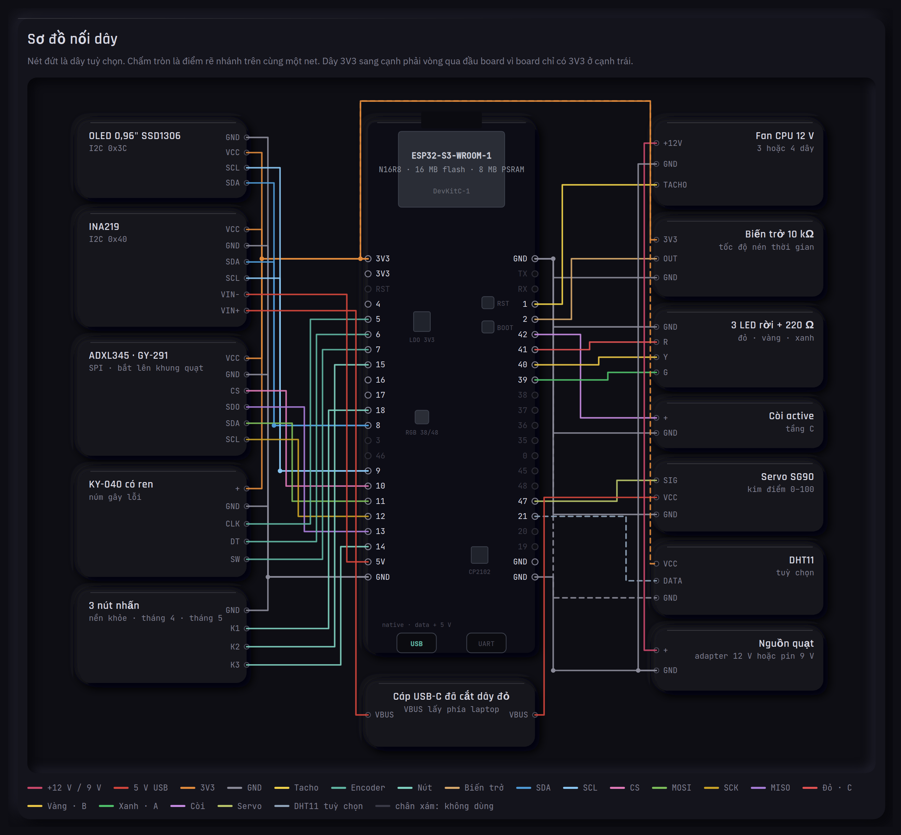

# HQC — BÁO CÁO BỔ SUNG LINH KIỆN DEMO (BẢN RÚT GỌN)

> Lập 10/09/2026. Trả lời ba câu: **vì sao bổ sung phần cứng** cho demo ESP32-S3, **mua gì và
> bỏ gì**, **nối thế nào**. Giá lấy từ giỏ hàng Shopee ngày 09/09/2026; các món "bỏ" đã có
> link và sơ đồ đầy đủ, để dành khi cần nâng cấp.

═══════════════════════════════════════════════════════════════════
# 1. VÌ SAO BỔ SUNG

Phase 04 đã xong: hai board ESP32-S3 DevKitC N16R8 chạy đủ ba tầng A/B/C, phát lại 42.064 mẫu
khớp 652/652 dòng với host. Nhưng demo hiện tại có ba điểm yếu khi trình bày:

| Điểm yếu | Hệ quả | Cách khắc phục |
|---|---|---|
| Dữ liệu vào là **phát lại file** qua USB | không chứng minh được chuỗi "cảm biến → đặc trưng → mô hình" | thêm cảm biến rung thật + xung tacho |
| Người xem chỉ **nhìn**, không thao tác | thiếu tương tác với hội đồng | thêm núm xoay gây lỗi, ấn để đổi kịch bản |
| **Chưa đo công suất** (điểm duy nhất còn thiếu trong bảng kết quả phase 04) | hội đồng chắc chắn hỏi | thêm INA219 đo chính board |

Nguyên tắc chọn: món nào bỏ đi thì demo mất một luận điểm mới giữ; món chỉ có tác dụng
trang trí thì bỏ.

# 2. DANH SÁCH SAU RÚT GỌN

## 2.1. Mua thêm — 4 món, ≈245.000 đ

| # | Linh kiện | Biến thể đã chọn | Giá | Vai trò trong ba tầng |
|---|---|---|---|---|
| 1 | **ADXL345** (GY-291) | SPI 4 dây, 3,3 V | 122.760 | gia tốc trên khung quạt → biên độ + pha 1X (tầng B, C) và Direct (tầng A) |
| 2 | **INA219** (MCU-219) | I2C 0x40 | 37.000 | dòng/áp/công suất của chính ESP32, số cho luận văn |
| 3 | **KY-040** có ren | 20 xung/vòng, ×1 | 30.020 | xoay = nhân biên độ kênh 2001; ấn = đổi kịch bản nền khỏe / tháng 4 / tháng 5 |
| 4 | **OLED 0,96"** SSD1306 | "1 GND", chữ xanh, I2C 0x3C | 55.080 | điểm, tầng, kênh nghi ngờ, mW ngay trên board |

## 2.2. Dùng đồ có sẵn — 0 đ (kiểm kê kho cũ 15/09/2026)

| Món | Nguồn | Vai trò |
|---|---|---|
| **Fan CPU 12 V** 3 hoặc 4 dây | đang dư | máy quay có tacho (dây vàng, 2 xung/vòng); dây xanh PWM cho phép ESP32 quét tốc độ |
| Adapter 12 V bất kỳ, hoặc **pin 9 V + kẹp có jack DC** | trong nhà / hộp kit cũ | chỉ nuôi quạt; cực âm nối chung GND ESP32 |
| **3 LED đỏ/vàng/xanh + điện trở 220 Ω** | hộp kit cũ | báo tầng A/B/C, cắm thẳng GPIO; không cần mua module LED |
| **Còi active** | hộp kit cũ | kêu khi vào tầng C |
| **3 nút nhấn** có mũ | hộp kit cũ | chọn kịch bản nền khỏe / tháng 4 / tháng 5 |
| **Biến trở 10 kΩ** | hộp kit cũ | núm tốc độ nén thời gian (ADC), thay encoder thứ hai |
| **Servo SG90** | hộp kit cũ | kim đồng hồ chỉ điểm 0–100, mặt số in giấy |
| Breadboard MB-102, jumper đực-đực và đực-cái, điện trở 10 kΩ | hộp kit cũ | nền lắp ráp; 10 kΩ kéo lên tacho nếu pull-up nội không đủ sạch |
| DHT11 | hộp kit cũ | nhiệt/ẩm phòng hiện góc OLED, tuỳ chọn |

Không dùng: Arduino UNO/Mega, HC-05, LCD 1602, động cơ bước, ma trận LED, shield động cơ, cáp USB A-B.

## 2.3. Đã loại và lý do

| Món loại | Chi phí tránh được | Mất gì |
|---|---|---|
| Đèn tháp 12 V + relay 4 kênh + adapter + jack DC | ≈400.000 | hình ảnh "tiếp điểm khô ra DCS"; nói một câu là hội đồng hiểu |
| Encoder thứ hai (tốc độ nén thời gian) | 30.000 | đặt từ trang web như hiện nay |
| Module 3 nút | 32.000 | nút ấn trên KY-040 thay thế |
| Máy in nhiệt | 250.000 | chỉ trình diễn, không có giá trị học thuật |
| Núm nhôm, cáp bọc chống nhiễu, Hall + nam châm | ≈100.000 | mua sau khi chắc chắn mang sang máy bơm của chuyên gia PDM |

Tổng: từ ≈900.000 đ xuống ≈245.000 đ. Sau kiểm kê kho cũ, còi, nút, biến trở, servo quay lại miễn phí; dây nối ≈44 jumper, hộp cũ đủ.

# 3. SƠ ĐỒ NỐI DÂY

Chân giữ nguyên giữa bản gọn và bản đầy đủ → firmware dùng chung, nâng cấp chỉ đổi dây.

| Nhóm | Chân ESP32-S3 | Ghi chú |
|---|---|---|
| **Cạnh trái** KY-040 CLK / DT / SW | GPIO5 / 6 / 7 | pull-up nội; ấn = đặt lại hệ số |
| 3 nút nền khỏe / tháng 4 / tháng 5 | GPIO18 / 15 / 14 | chân kia GND, pull-up nội |
| I2C SDA / SCL (OLED + INA219) | GPIO8 / 9 | |
| SPI CS / MOSI / SCK / MISO (ADXL345) | GPIO10 / 11 / 12 / 13 | mode 3, 2 MHz; trên GY-291: SCL=SCK, SDA=MOSI, SDO=MISO |
| PWM quạt (tuỳ chọn) | GPIO4 | LEDC 25 kHz |
| INA219 VIN+ / VIN- | dây đỏ cáp **USB-C** đã cắt: phía laptop / 5V-in | đo đúng board; LED 3V3 nằm trong số đo (~10 mA/màu) |
| **Cạnh phải** tacho quạt | GPIO1 | pull-up nội, ngắt cạnh xuống, 2 xung/vòng |
| Biến trở tốc độ | GPIO2 | ADC1_CH1; 3V3 vòng qua đầu board |
| Còi active | GPIO42 | HIGH kêu; 3,3 V kêu nhỏ, qua NPN nếu cần to |
| LED đỏ / vàng / xanh | GPIO41 / 40 / 39 | mỗi LED một điện trở 220 Ω, HIGH sáng |
| Servo SG90 | GPIO47 | LEDC 50 Hz; VCC lấy 5 V **trước** INA219 |
| DHT11 (tuỳ chọn) | GPIO21 | |

Sơ đồ vẽ theo bố trí chân thật của DevKitC-1 (22 chân mỗi cạnh, ảnh board 15/09): bus và núm ở
cạnh trái, quạt và đầu ra ở cạnh phải, không dây nào phải vòng qua board trừ 3V3 sang cạnh phải.
Cổng USB-C **trái** (silk "USB", native) là cổng dữ liệu + 5 V; cổng phải (silk "UART", cạnh chip
CP2102) chỉ dùng cho log ESP-IDF.

Tránh GPIO35–37 (PSRAM octal N16R8), 19/20 (USB), 0/3/45/46 (strapping), 43/44 (UART), 38/48 (LED RGB tuỳ revision).

File: `Bao_cao/demo/bench/so-do-noi-day-ban-thu-gon-esp32s3.{html,png}` (bản gọn),
`so-do-noi-day-ban-thu-quat-esp32s3.{html,png}` (bản đầy đủ có đèn tháp, relay, 2 encoder, 3 nút),
`huong-dan-lap-breadboard-ban-thu-gon.html` (hướng dẫn cắm breadboard MB-102 theo toạ độ lỗ, 8 giai đoạn, 66 bước).

# 4. CÁCH DÙNG TRONG DEMO

1. **Nền khỏe:** quạt chạy cân bằng 30–60 phút, ghi vector 24 cột (8 amp + 8 sin + 8 cos), chạy
   `scripts/New/26_quantize_sae_int8.py` sinh header mới → nạp lại, engine không sửa.
2. **Gây lỗi:** dán đất sét lên một cánh (mất cân bằng, 1X tăng, pha xoay theo vị trí dán) hoặc
   xoay KY-040 nhân biên độ kênh 2001 → điểm leo từ xanh sang đỏ.
3. **Nén thời gian:** engine nhận dấu thời gian là tham số; mỗi khối 2 giây gắn nhãn "10 phút",
   một ngày nhà máy ≈ 10 phút quạt; tầng A phản ứng tức thì, tầng B/C theo ngày/tuần nén.

Phải nêu khi trình bày: (a) gia tốc kế đo rung vỏ, không phải dịch chuyển trục như đầu dò
nhà máy, µm không so được với mốc 65 µm; (b) mô hình nhà máy không dùng lại trên quạt, chỉ
**phương pháp và mã nguồn** dùng lại; (c) tầng ngưỡng tuyệt đối cho máy nhỏ tham chiếu vùng
ISO 20816-3 theo vận tốc mm/s.

# 5. VIỆC TIẾP THEO

| Việc | Ước lượng | Phụ thuộc |
|---|---|---|
| ~~Module thu thập~~ **ĐÃ VIẾT 16/09**: `bench_pins.h`, `adxl345_spi.c`, `ssd1306_i2c.c`, `tacho_order.c`, `bench_main.c` (lấy mẫu 1 kHz, order tracking 1X theo tacho, RMS, OLED, LED/còi/servo, nút, KY-040, biến trở). Chạy song song với phát lại, build `HQC_BENCH=1 idf.py -B build_bench build`. Ảnh nạp: `Bao_cao/demo/bench/firmware-bench/` | đã build, **chưa nạp/thử trên board** | board cắm vào máy |
| Tham số hoá `SAE_N=24` trong script 26 nếu đổi bộ đặc trưng | 1 dòng | chỉ khi không có tacho |
| Ghi nền khỏe quạt, sinh header, chạy thử ba tầng nén thời gian | 1 buổi | firmware xong |
| Nâng cấp (tuỳ chọn): đèn tháp + relay theo sơ đồ đầy đủ; máy bơm chuyên gia PDM (Hall + nam châm, cáp bọc) | | quyết định sau |

# 6. SỰ CỐ 15/09/2026

**INA219 rơi IC**: chip INA219 (SOT23-8, vị trí P5) bong khỏi board khi nhận hàng, pad còn nguyên,
điện trở shunt R100 còn. Xử lý theo thứ tự: (1) khiếu nại Shopee "hàng lỗi" trong 7 ngày, ảnh
chụp làm bằng chứng; (2) nếu có mỏ hàn mũi nhỏ + flux, hàn lại được nhưng cần tay nghề, rủi ro
lệch chân; (3) mua module khác 37k. Chưa có INA219 thì đo công suất tạm bằng USB power meter
hoặc đồng hồ vạn năng nối tiếp dây đỏ, độ phân giải kém hơn nhưng đủ số cho luận văn.

Cập nhật 15/09 tối: đã hàn header, chip không cứu được → module bỏ. Quyết định: đặt INA219 mới,
đo tạm bằng đồng hồ vạn năng; giai đoạn 8 của hướng dẫn breadboard để dành cho module mới.

# 7. TRẠNG THÁI 16/09 CHIỀU (mất điện, hoãn báo cáo)

- Dây đực-cái hỏng toàn bộ → ESP32 cắm hàng chân 3V3 vào hàng a breadboard, thân treo ngoài mép, dùng dây đực-đực. Chân mới:
  tacho 4, LED xanh/vàng/đỏ 5/6/7, còi 15, nút 16/17/18, I2C 8/9, SPI 10–13, PWM quạt 14; encoder/servo/biến trở tắt.
- Đã chạy: OLED, ADXL345, 3 nút, LED. Chưa: quạt (cần pin 9 V), ADXL345 chưa gắn lên quạt (cần mini breadboard).
- Firmware gộp: nút bấm → `{"t":"BTN"}`; lệnh `X` xoá trạng thái; LED breadboard theo tầng phát lại. Trang web: 3 đoạn
  (20/02 nền khỏe · 01/03 tháng 4 · 01/04 tháng 5), nhảy đoạn bằng nút trên bàn thử hoặc trên màn hình. Đã kiểm chứng B14 06/04.
- Đã đẩy sang Avocado-3 `C:\Users\minht\hqc-esp32\` kèm `TOI-NAY-AVOCADO.txt`.

# 8. CÂU HỎI CHƯA CHỐT

1. Fan CPU đang dư là 3 dây hay 4 dây (có PWM không)?
2. ~~Breadboard, jumper~~ đã có trong hộp kit cũ (15/09).
3. Máy bơm của chuyên gia PDM: tốc độ quay, có biến tần, có chỗ gắn nam châm/băng phản quang, có sẵn cảm biến 4–20 mA không? Chưa liên hệ được.
4. Giá Shopee của ADXL345 (122.760) cao gấp đôi mặt bằng; chấp nhận để gom shop hay đổi shop?
