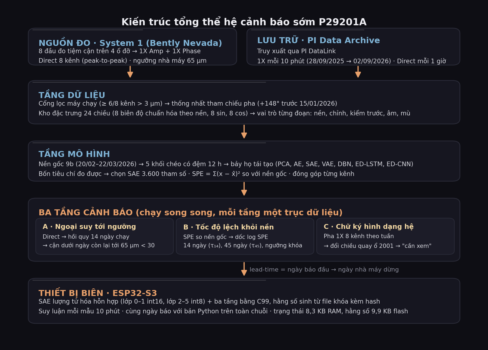
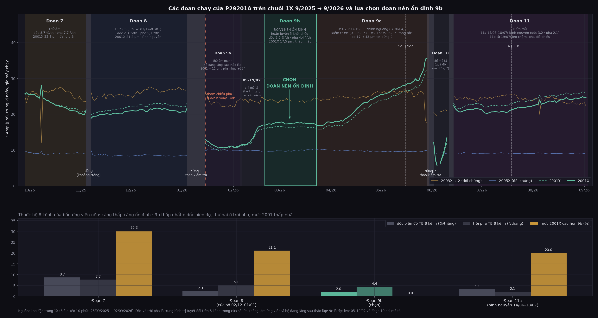
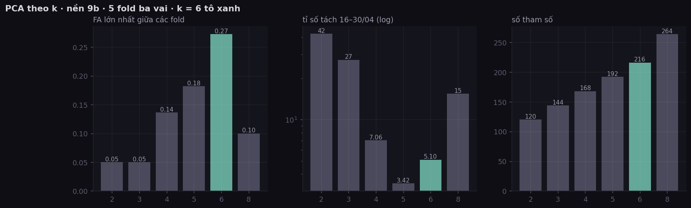
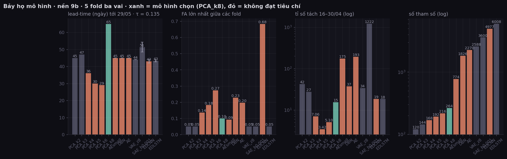
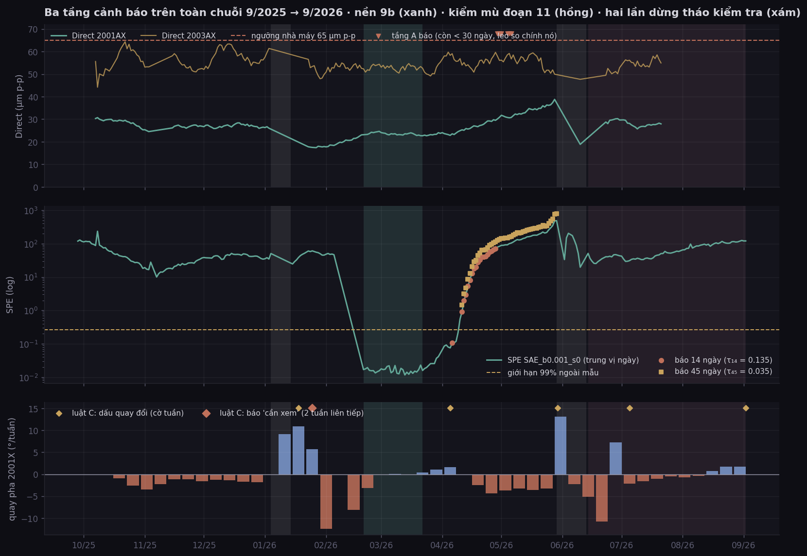

# BÁO CÁO ĐỒ ÁN

**Tên đồ án:** Nghiên cứu và xây dựng hệ thống cảnh báo sớm bất thường thiết bị quay
ứng dụng học sâu tái tạo trên dữ liệu giám sát tình trạng công nghiệp

**Tên tiếng Anh:** Early Warning of Rotating Machinery Anomalies using
Reconstruction-based Deep Learning on Industrial Condition-Monitoring Data

**GVHD:** ThS. Phan Đình Duy · **Trường:** ĐH Công nghệ Thông tin – ĐHQG TP.HCM,
Trung tâm Phát triển CNTT

**Nhóm thực hiện:** Trương Ngọc Sơn (25210183) · Trần Tín Nghĩa (25210147) ·
Hồ Thị Mỹ Phương (25210170)

---

## 1. TỔNG QUAN ĐỀ TÀI

### 1.1. Bài toán

Thiết bị động (bơm, máy nén, tua-bin) là các thiết bị quan trọng trong hệ thống công nghệ tuần hoàn khép kín của các nhà máy công nghiệp, được lắp đặt nhiều cảm biến để giám sát khả năng vận hành. Khi thiết bị hỏng, chi phí sửa chữa và tổn thất sản xuất rất lớn; nên nhà máy thường bảo trì phòng ngừa, thay thế chi tiết theo lịch hoặc theo số giờ vận hành. Cách làm này gặp ba hạn chế:

1. **Phát hiện trễ.** Ngưỡng phải đặt cao để tránh báo động giả, nên khi chạm ngưỡng thì hư
   hỏng đã xuất hiện.
2. **Không có dữ liệu hỏng gán nhãn.** Thiết bị được bảo trì phòng ngừa, rất ít khi chạy tới
   hỏng thật, nên học có giám sát không áp dụng được.
3. **Tải lẫn với hư hỏng.** Biên độ rung phụ thuộc tải và tốc độ; ngưỡng cố định không phân
   biệt được nguyên nhân.

Đồ án đặt câu hỏi: thay vì *"giá trị đã vượt ngưỡng chưa?"*, hỏi *"hành vi hiện tại có
còn giống lúc thiết bị vận hành ổn định không, và đang dịch chuyển nhanh đến đâu?"*. Câu hỏi này phát hiện được
**thay đổi tương quan giữa các cảm biến** và **tốc độ thay đổi**, thường xuất hiện sớm hơn việc
một con số đơn lẻ vượt ngưỡng.

### 1.2. Đối tượng

- **Thiết bị:** bơm cao áp **P29201A** cấp nước cho lò hơi tại cụm Steam
  Generation, Nhà máy Đạm Cà Mau. Bốn ổ đỡ, mỗi ổ hai đầu đo tiệm cận lệch 90° (X, Y), tổng
  8 kênh rung.

**Hình 1.1: Màn hình giám sát tình trạng (CBM) của cụm bơm cấp nước lò hơi trên hệ System 1.** Trạng thái chạy,
số giờ vận hành, lần bảo dưỡng gần nhất, sơ đồ máy với các điểm đo rung 29VT (Direct, µm) và nhiệt ổ đỡ 29TE (°C),
cùng xu hướng tốc độ. Đây là giao diện người vận hành đang dùng để theo dõi theo ngưỡng.

### 1.3. Công trình tham chiếu

Gribbestad, Hassan, Hameed và Sundli, *Health Monitoring of Air Compressors Using
Reconstruction-Based Deep Learning for Anomaly Detection with Increased Transparency*,
Entropy 2021, 23, 83 [1]. Công trình này đặt đúng bài toán của công nghiệp: rất ít nhãn, rất ít
ca chạy-đến-hỏng. Cách giải: huấn luyện mô hình tái tạo **chỉ trên dữ liệu bình thường**, dùng
sai số tái tạo làm chỉ số bất thường, quy đổi sang thang 0–100 ba vùng, và tính **đóng góp của
từng cảm biến** để tăng tính giải thích. Sáu kiến trúc được so sánh; VAE và ED-LSTM đạt độ
chính xác 1,00 trên 350 mẫu thử.

Ba điểm yếu công trình tự nhận, và là nơi đồ án nhắm tới:

| Điểm yếu paper tự nêu | Vị trí trong paper |
|---|---|
| Ngưỡng 40/60 và tham số sigmoid phải chỉnh tay, nhạy với thay đổi | Discussion |
| Không có hàm chấm điểm để chọn kiến trúc tự động; tối ưu quá mạnh làm mô hình "sao chép" đầu vào và mất tín hiệu | Discussion, Future Work |
| Chỉ trả lời "có gì đó sai", không trả lời "sai ở cơ chế nào" và "khi nào hỏng" | Introduction, §8 |

### 1.4. Thuật ngữ

**Bảng 1.1: Thuật ngữ dùng trong báo cáo**

| Thuật ngữ | Nghĩa trong báo cáo này |
|---|---|
| **1X Amp, 1X Phase** | Biên độ (µm) và góc pha (°) của thành phần rung đồng bộ với tốc độ quay, do System 1 trích sẵn cho từng kênh; đầu vào của mô hình |
| **Direct** | Rung tổng peak-to-peak (µm) của mỗi kênh; trục dữ liệu của tầng A và là đại lượng nhà máy đặt ngưỡng 65 µm |
| **Kênh** | Một đầu đo tiệm cận; ký hiệu theo ổ đỡ và hướng, ví dụ 2001X, 2003Y; máy có 8 kênh trên 4 ổ đỡ |
| **Nền gốc** | Đoạn máy chạy ổn định nhất theo thước cả hệ 8 kênh (đoạn 9b, 20/02–22/03/2026); mô hình chỉ học trên đoạn này và mọi so sánh về sau đều so với nó |
| **SPE** | Sai số tái tạo bình phương Σ(x − x̂)² trên 24 chiều đã chuẩn hóa; đo máy đã khác nền gốc bao nhiêu |
| **Khối** | Một trong 5 phần liên tiếp ≈ 6 ngày mà nền gốc được chia ra, có đệm 12 giờ ở hai đầu để hai khối kề nhau không chia sẻ mẫu còn tương quan |
| **Fold** | Một vòng huấn luyện và kiểm tra: một khối làm kiểm tra ngoài mẫu, khối đứng trước nó làm dừng sớm, ba khối còn lại làm huấn luyện; xoay đủ 5 fold thì mỗi khối được làm kiểm tra đúng một lần, kết quả ngoài mẫu phủ toàn bộ nền gốc |
| **Đoạn âm** | Đoạn máy chạy không có suy giảm đang tiến triển (giảm dần hoặc phẳng): đoạn 7, 8, 9a; hệ không được phép báo trên đó, dùng để chỉnh ngưỡng |
| **Ngưỡng tốc độ τ** | Ngưỡng trên độ dốc của log SPE theo ngày (τ₁₄ cho cửa sổ 14 ngày, τ₄₅ cho 45 ngày); chỉnh trên đoạn âm và nửa đầu đợt leo, sau đó khóa |
| **Khóa (lock)** | Ghi bộ tham số đã chốt kèm mã kiểm tra (hash) của mọi file đầu vào; các bước sau từ chối chạy nếu đầu vào đổi, và mỗi lần chạy lại đều được ghi log |
| **Kiểm mù** | Chạy đúng một lần trên đoạn dữ liệu chưa từng được nhìn khi chọn bất kỳ tham số nào (đoạn 11, 14/06–02/09/2026), sau khi đã khóa; kết quả ghi nguyên, không chỉnh lại |
| **Lead-time** | Số ngày từ ngày một tầng báo lần đầu (trong 120 ngày trước sự kiện) tới ngày nhà máy dừng máy |
| **Tầng A, B, C** | A: ngoại suy Direct tới 65 µm; B: tốc độ lệch khỏi nền gốc theo SPE; C: chữ ký hình dạng hệ (Bảng 2.4) |
| **Chữ ký hình dạng hệ** | Cách 8 kênh đứng so với nhau về pha và biên độ, tính theo tuần: ổ nào quay pha, quay chiều nào, ổ nào giữ nguyên; đổi chiều quay là dấu hiệu của một cơ chế mới |
| **Đóng góp kênh** | Phần của SPE do từng kênh gây ra (r²amp + r²sin + r²cos); kênh đóng góp lớn nhất chỉ ra ổ đỡ đang suy giảm |

### 1.5. Mục tiêu

1. Xây kho đặc trưng 1X (biên độ và pha 8 kênh, bước 10 phút) trên toàn chuỗi lịch sử kéo được,
   với cổng lọc trạng thái chạy và hệ quy chiếu pha thống nhất.
2. Chọn **nền gốc** bằng thước ổn định của cả hệ 8 kênh, và chia dữ liệu theo vai trò (train,
   kiểm tra, chỉnh ngưỡng) sao cho không tham số nào được chọn trên dữ liệu
   dùng để đánh giá nó.
3. Huấn luyện bảy họ mô hình tái tạo của [1] (PCA, AE, SAE, VAE, DBN, ED-LSTM, ED-CNN) **chỉ trên
   nền**, không nhãn, qua cùng một giao thức kiểm tra chéo theo khối; chọn mô hình bằng lead-time
   đo được và tỉ lệ báo giả giữa các khối, không bằng sai số tái tạo.
4. Thay ngưỡng chỉnh tay bằng **luật theo tốc độ thay đổi** với ngưỡng chỉnh trên đoạn âm và khóa
   trước khi kiểm mù; ghép thành **ba tầng cảnh báo** (ngoại suy tới 65 µm, tốc độ lệch khỏi nền,
   chữ ký hình dạng hệ) và đo **lead-time** trước hai mốc dừng máy thật.
5. Lớp **giải thích được**: đóng góp từng kênh chỉ ra ổ đỡ đang suy giảm; dịch sang cơ chế cơ học
   bằng tri thức rotor.
6. Lượng tử hóa mô hình sang số nguyên, viết lại ba tầng bằng C, kiểm chứng cho **cùng ngày báo**
   với bản Python trên toàn chuỗi, biên dịch cho vi điều khiển ESP32-S3.

---

## 2. GIẢI PHÁP ĐỀ XUẤT

### 2.1. Kiến trúc tổng thể

**Hình 2.1: Kiến trúc tổng thể của hệ cảnh báo sớm.** Từ trên xuống: nguồn đo và lưu trữ, tầng dữ liệu, tầng mô hình, ba tầng
cảnh báo chạy song song, và thiết bị biên ESP32-S3. Lead-time đo từ ngày một tầng báo lần đầu tới ngày nhà máy dừng máy.

### 2.2. Dữ liệu

Dữ liệu lấy từ PI Data Archive (OSIsoft/AVEVA) qua PI DataLink; hệ giám sát rung System 1 (Bently Nevada) trích sẵn thành
phần 1X (biên độ và pha) và rung tổng `Direct` (peak-to-peak) cho 8 kênh.

Kho đặc trưng 1X gồm **42.064 mẫu 10 phút** sau cổng lọc máy chạy (44.358 dòng kéo về), phủ 28/09/2025 → 02/09/2026;
cộng 7.129 giờ `Direct` cho tầng A (file `Direct` 5 năm chỉ tới 21/07/2026). Toàn bộ chuỗi được chấm và phát lại, không lấy
mẫu thưa. Độ sâu archive 1X trên PI ít nhất 340 ngày (kéo được từ 28/09/2025), không với tới mốc bảo trì 31/05/2025, nên
lead-time đo trên hai lần dừng năm 2026. Quy tắc kéo: tag phải kết thúc ở thuộc tính giá trị thật (`|1X Amp`, `|1X Phase`,
`|Direct`); ba bản xuất lấy nhầm `|Trigger|Current percent` cho giá trị 0 hằng số và bị loại.

**Bảng 2.1: Sáu lần kéo 1X từ PI (8 kênh 1X Amp + 1X Phase, bước 10 phút, kéo ngày 03/09/2026)**

| Đoạn | File | Dòng | Nội dung | Vai trò trong thực nghiệm |
|---|---|---|---|---|
| 7 · 28/09–04/11/2025 | `28.9.25-4.11.25.xlsx` | 5.329 | ổ 2001 giảm −5,5 µm/tháng, 25,5 → 19,9 | thử âm |
| 8 · 07/11/2025–04/01/2026 | `Doan8_7.11.25-4.01.26.xlsx` | 8.353 | bình nguyên 21 µm, pha quay −7°/tháng | thử âm |
| 9a · 15/01–05/02/2026 | `Doan-9a.15.01.26–05.02.26.xlsx` | 3.025 | 2001 = 11 µm, thấp nhất từng ghi; hệ đang lắng | thử âm mạnh |
| **9b · 20/02–22/03/2026** | `Doan9b_20.02.26-22.03.26.xlsx` | 4.321 | khớp `51_Vib180d` từng giờ, Δ = 0 | **nền gốc** |
| 9c · 23/03–13/06/2026 | `Doan9c_23.03.26-13.06.26.xlsx` | 11.809 | leo 17 → 43 µm tới dừng 2 | chỉnh ngưỡng, kiểm trước; 02–10/06 chỉ mô tả |
| 11 · 14/06–02/09/2026 | `Doan11_14.06.26-2.09.26.xlsx` | 11.521 | bình nguyên 21 rồi leo lại từ 19/07 | kiểm mù |

**Hình 2.2: Vị trí các điểm đo trên sơ đồ máy.** Mỗi ổ đỡ có một cặp đầu đo tiệm cận lệch 90° (X, Y) đo rung tổng
Direct (µm) và biên độ, pha 1X; các điểm 29TE đo nhiệt ổ đỡ (°C). Mô hình dùng 8 kênh rung của bốn ổ đỡ; nhiệt và
tốc độ chỉ dùng làm bối cảnh.

**Hình 2.3: Các đoạn chạy của P29201A và lựa chọn nền gốc 9b.**

- **Thời gian:** 28/09/2025 → 02/09/2026. Vạch chấm cam tại 15/01/2026 là mốc đổi tham chiếu pha 148°.
- **Ba khoảng dừng máy (màu xám):**
  - 04–07/11/2025: khoảng trống dữ liệu, máy dừng ngắn.
  - 04–15/01/2026: dừng 1, tháo kiểm tra.
  - 29/05–14/06/2026: dừng 2, tháo kiểm tra, gồm đợt dừng ngắn 11–13/06.
- **Vai trò từng đoạn:**
  - Đoạn 7 (28/09–03/11/2025): đoạn âm, hệ không được báo.
  - Đoạn 8 (07/11/2025–03/01/2026): đoạn âm; cửa sổ 02/12–01/01 dùng chỉnh ngưỡng.
  - Đoạn 9a (15/01–05/02/2026): đoạn âm mạnh, hệ đang lắng sau tháo lắp.
  - Khoảng 05–19/02/2026: chỉ mô tả, bước 1 giờ, máy leo vào nền.
  - **Đoạn 9b (20/02–22/03/2026): nền gốc**, huấn luyện mô hình.
  - Đoạn 9c (23/03–29/05/2026): đợt leo tới dừng 2; 9c1 chỉnh ngưỡng tới 30/04 rồi kiểm trước 01–29/05, 9c2 từ 16/05 tăng tốc.
  - Đoạn 10 (02–10/06/2026): quá độ sau dừng 2, chỉ mô tả.
  - Đoạn 11 (14/06–02/09/2026): kiểm mù; 11a bình nguyên 14/06–18/07, 11b leo chậm từ 19/07 với pha đổi chiều.

### 2.3. Đặc trưng và mô hình

**Đầu vào 24 chiều:** 8 × 1X Amp chuẩn hóa theo nền (min–max về [−1, 1] theo phân vị 1–99 cho mạng
nơ-ron, z-score cho PCA) + 8 × 1X Phase chuyển thành cặp sin/cos (16 cột). Các hệ số chuẩn hóa (phân vị 1–99
hoặc trung bình và độ lệch chuẩn của từng kênh) chỉ tính từ khối huấn luyện của mỗi fold, rồi áp
nguyên cho khối kiểm tra; khối kiểm tra không góp bất kỳ con số nào vào hệ số này, để kết quả ngoài
mẫu không bị rò rỉ thông tin.

**Bộ mô hình:** đủ bảy họ của [1] và đường cơ sở tuyến tính: PCA (k = 2…8), Autoencoder (hai cỡ),
Sparse Autoencoder (phạt L1 trên kích hoạt), Variational Autoencoder, Deep Belief Network (ba RBM),
Encoder–Decoder LSTM và Encoder–Decoder CNN (cửa sổ 20 mẫu). Mô hình ngẫu nhiên chạy ba lần khởi tạo ngẫu nhiên;
tổng 27 cấu hình. Không loại kiến trúc nào trước bằng lý lẽ về số trọng số: nền 9b có 4.321 mẫu
10 phút, và tiêu chí loại là số đo.

**Giao thức huấn luyện: năm khối ba vai.** Nền 9b chia 5 khối ≈ 6 ngày, trống 12 giờ hai bên mỗi
ranh giới. Mỗi fold: một khối test (SPE ngoài mẫu), khối đứng trước làm kiểm tra (dừng sớm, số
vòng huấn luyện), ba khối còn lại train. Năm fold phủ toàn bộ 9b. Mô hình cuối huấn luyện lại trên cả 9b với số vòng huấn luyện
trung bình của các fold.

**Tiêu chí chọn** (theo cảnh báo của [1]: tái tạo tốt bình thường **và** residual phải tăng khi lệch):

1. **Ổn định giữa các khối nền:** lấy giới hạn 99% từ bốn khối rồi chấm khối còn lại, tỉ lệ vượt trung
   bình ≤ 3% và lớn nhất ≤ 10%.
2. **Tách được:** tỉ số trung vị SPE(16–30/04/2026) / trung vị SPE ngoài mẫu trên nền ≥ 1,3.
3. **Lead-time đo được** trước mốc dừng thật, không tính ngày báo bị giới hạn bởi ngày sớm nhất luật có thể phát báo động (báo ngay ngày đầu luật
   có thể phát báo động).
4. **Giải thích đúng ổ:** đóng góp lớn nhất trong đợt leo phải rơi vào ổ mà bằng chứng độc lập cho thấy
   đang thay đổi.

Sai số tái tạo nhỏ nhất **không** phải tiêu chí.

### 2.4. Ưu điểm của đô án so với Paper tham chiếu.

Giải pháp ở các mục 2.2, 2.3 và 2.5–2.7 được thiết kế bám theo những điểm yếu mà [1] tự nhận ở phần
Discussion và Future Work. Bảng dưới đối chiếu từng điểm yếu với tài sản dữ liệu tương ứng trong
`Dataraw/` và vấn đề cụ thể mà nhờ đó đồ án làm tốt hơn.

**Bảng 2.2: Điểm yếu của [1], dữ liệu đồ án có, và vấn đề giải được**

| Paper yếu ở đâu (tự nhận) | Dataraw có gì | Làm tốt hơn ở vấn đề nào |
|---|---|---|
| Cảm biến vô hướng, ẩn danh S1…S8. Minh bạch chỉ dừng ở "cảm biến nào lệch" | 8 kênh rung dạng vector: 1X Amp + 1X Phase, gắn với 4 ổ đỡ có vị trí vật lý rõ | Trả lời được câu "hỏng gì" bằng cơ học rotor: 1X tăng pha giữ là mất cân bằng, pha quay dần là điểm nặng di chuyển. Paper chỉ trả lời "có gì đó sai" |
| Ngưỡng 40/60 và sigmoid chỉnh tay, nhạy với thay đổi | Ba đoạn máy chạy không có suy giảm (đoạn 7, 8, 9a) và một đợt leo tới dừng máy thật (9c) | Ngưỡng tốc độ chỉnh trên đoạn âm và khóa trước khi kiểm mù. Thay bước chỉnh tay bằng ngưỡng chọn từ đoạn âm và khóa trước khi kiểm mù, điểm paper coi là nhược điểm lớn nhất |
| Không có bằng chứng độc lập ngoài nhãn chuyên gia | Waveform thô 2048 điểm, 16,9 kHz, tính được toàn bộ phổ | Kiểm chứng chẩn đoán bằng phổ độc lập với mô hình. Ổ 2003 được xác nhận mất cân bằng sẵn có theo cách này |
| Không đặt câu hỏi "khi nào hỏng" | Hai mốc dừng tháo kiểm tra năm 2026 có ngày giờ, cộng Run Hours theo ngày và `Direct` phủ 5 năm lịch | Đo được lead-time giữa ngày tầng báo lần đầu và ngày nhà máy dừng. Paper bỏ ngỏ câu hỏi thứ ba của PHM |
| Một loại máy, một thiết bị, chuỗi ngắn | Cụm 5 máy, hai cặp song song A/B cùng quy trình | Máy song song làm "bình thường thứ hai" để đối chứng, và kiểm tổng quát hoá giữa các máy (hướng phát triển) |
| Lỗi được ép cưỡng bức, ghi mốc 33/67/100% bằng tay | Suy giảm tự nhiên đang diễn ra ở ổ 2001, tải giữ nguyên, pha quay đều một chiều suốt 10 tháng rồi đổi chiều | Tính thực tế cao hơn. Đây là hiện tượng thật đang tiến triển, không phải thí nghiệm |
| Chọn kiến trúc bằng thử sai, muốn có hàm chấm điểm tự động | Nền 9b đủ dài cho năm khối chéo; đợt leo có mốc dừng để đo lead-time | Bốn tiêu chí đo được (ổn định giữa khối, tách, lead-time thật, đúng ổ) thay cho hàm chấm điểm mà paper đề xuất làm trong tương lai |

**Bảng 2.3: Yêu cầu dữ liệu của [1] và dữ liệu đồ án có**

| [1] cần | [1] có | Đồ án có | Đánh giá |
|---|---|---|---|
| Dữ liệu bình thường để train | 8 chuỗi, 77–1.250 mẫu, 14 cảm biến, nhiều mức tải | 1 nền 4.321 mẫu 10 phút (≈100 mẫu độc lập), 24 đặc trưng, một điểm tải | Đủ về lượng, thiếu đa dạng |
| Bộ cấu hình run-to-failure chỉnh thang điểm | 7 chuỗi có mốc 33/67/100% | 1 đợt leo tới dừng tháo kiểm tra (9c), không có mốc mức độ; 3 đoạn âm | Thay bằng lead-time và tỉ lệ báo giả trên đoạn âm |
| Bộ đánh giá có nhãn, chuỗi chưa thấy | 150 + 200, 4 kiểu lỗi, 2 kiểu chưa từng thấy | Đoạn 11 kiểm mù (11.521 mẫu) với một đợt leo chậm chưa từng thấy; không có nhãn chuyên gia | Một phần |

Điểm mạnh so với [1] nằm ở **bản chất** dữ liệu chứ không ở khối lượng: rung vector có pha gắn ổ
đỡ cụ thể; hai mốc dừng máy thật; waveform thô để kiểm chứng phổ độc lập; cụm 5 máy có hai cặp song
song; và một đợt suy giảm **tự nhiên** đang diễn ra thay vì lỗi ép cưỡng bức.

Hai điểm khác [1] nằm ở phương pháp, không phải dữ liệu. Cấu trúc cây theo hệ con tua-bin,
bơm, bốn ổ đỡ là điều paper đề xuất cho tương lai và ta có sẵn từ cách bố trí cảm biến. Triển
khai nhúng là bước "từ train đến deploy" mà paper chỉ mới nêu: SAE lượng tử hóa hỗn hợp int16/int8
và ba tầng bằng C biên dịch cho ESP32-S3, giữ nguyên 100 % ngày báo so với bản Python (mục 3.5).

Ba chỗ paper vẫn mạnh hơn được nêu ở Bảng 2.3 và mục 4.1: đa dạng chuỗi bình thường ở nhiều mức
tải, chuỗi chạy-đến-hỏng có mốc mức độ, và kiểu lỗi chưa từng thấy để kiểm tổng quát hóa.

---

### 2.5. Phát hiện và giải thích

| Bước | Đại lượng | Trả lời |
|---|---|---|
| 1 | SPE = Σ(x − x̂)² trên 24 chiều đã chuẩn hóa, so với **một nền gốc cố định**; giới hạn 99% trên SPE ngoài mẫu (mẫu 6 giờ) làm vạch tham chiếu | Máy **đã khác** lúc ổn định bao nhiêu |
| 2 | Độ dốc của log SPE theo trung vị ngày trên cửa sổ 14 ngày và 45 ngày lịch; ngưỡng τ chỉnh trên đoạn âm và khóa | Máy đang **dịch chuyển nhanh đến đâu**, **từ khi nào** |
| 3 | Đóng góp từng kênh `C_j = (r²amp + r²sin + r²cos)_j / SPE`, 8 kênh | Bất thường **ở đâu** |

**Gọi tên cơ chế hư hỏng bằng kiến thức cơ khí, không cần dữ liệu có nhãn.** Mô hình chỉ nói
"ổ nào đang lệch"; bước cuối là người đọc kết quả theo quy tắc chẩn đoán rung của máy quay trong
tiêu chuẩn ISO 13373 [4], xét thành phần rung theo bậc của tốc độ quay:

- **0,5X:** là **xoáy dầu (oil whirl)** của ổ trượt màng
  dầu.
- **1X:** là **mất cân bằng**.
- **Tần số không đồng bộ trên dải rộng:** là **hỏng vòng bi**.

Đây là điểm khác [1]: cảm biến của họ vô hướng và ẩn danh nên đóng góp dừng ở "cảm biến số mấy";
của đồ án là vector rung gắn ổ đỡ cụ thể nên đóng góp dịch thẳng thành cơ chế hư hỏng.

**Ranh giới quan sát / suy luận** giữ xuyên suốt: "1X chiếm 98% năng lượng phổ" là quan sát;
"mất cân bằng" là suy luận từ tri thức ngoài dữ liệu.

### 2.6. Ba tầng cảnh báo và thước đo lead-time

Tầng phát hiện ở mục 2.5 trả lời "đã khác / đang rời xa / ở đâu". Để trả lời "khi nào" và không phụ
thuộc một trục dữ liệu duy nhất, thiết kế **ba tầng chạy song song**, mỗi tầng một trục dữ liệu, một
câu hỏi, một quy tắc báo riêng.

**Bảng 2.4: Ba tầng cảnh báo**

| Tầng | Trục dữ liệu | Cách tính | Quy tắc báo |
|---|---|---|---|
| **A. Ngoại suy tới ngưỡng** | `Direct`, 8 kênh | Trung vị ngày trên giờ máy chạy; hồi quy tuyến tính trên **14 ngày chạy** cùng đoạn (không vắt qua lần dừng); ngoại suy tới **65 µm**, cùng một mức cho cả 8 kênh; cận dưới số ngày còn lại lấy từ khoảng tin cậy 90% của độ dốc | Báo khi kênh **đang leo so với chính nó** (mức > 1,10 × trung vị 90 ngày trước), dốc có ý nghĩa (t > 1,645) và **cận dưới còn < 30 ngày**, giữ ≥ 2 ngày liên tiếp. Bỏ **hai ngày đầu sau khởi động** |
| **B. Tốc độ lệch khỏi nền gốc** | SPE (mục 2.5) | **Một nền gốc cố định** (9b). SPE so nền là **trạng thái** | Báo theo **độ dốc log SPE**: thang 14 ngày (τ₁₄, ≥ 3 ngày liên tiếp) và thang 45 ngày (τ₄₅, ≥ 5 ngày liên tiếp, ≥ 30 ngày quan sát). Thang 45 ngày giữ được báo khi thang 14 ngày đã ngừng báo vì log SPE bão hòa |
| **C. Cơ chế hư hỏng** | `1X Phase` 8 kênh | Chữ ký **hình dạng cả hệ 8 kênh** mỗi tuần: trung bình và độ lệch chuẩn tròn của pha, tốc độ quay pha (hồi quy 4 tuần), biên độ | Báo **mức thấp "cần xem"** khi chiều quay pha ổ 2001X đổi dấu so với 8 tuần trước, \|tốc độ\| > 1°/tuần hai phía, sd < 5°, giữ 2 tuần liên tiếp; ngày báo là ngày cuối tuần. Chưa phân biệt mất cân bằng / lệch trục cho tới khi có `2X Amp` |

Ba tầng bổ sung nhau: A dùng ngưỡng tuyệt đối mà nhà máy đang vận hành nên dễ được chấp nhận;
B dùng ngưỡng tương đối nên bắt được thay đổi khi A còn xa ngưỡng; C chỉ báo mức thấp "cần xem",
là lớp đọc cơ chế chứ chưa đủ bằng chứng để tự báo mức cao.

### 2.7. Tầng triển khai nhúng

Mô hình tầng B (SAE 3.600 tham số) và toàn bộ luật ba tầng được đưa lên vi điều khiển **ESP32-S3**
(Xtensa hai lõi 240 MHz, 512 KB RAM, 16 MB flash). Nguyên tắc: không huấn luyện lại, không đổi
ngưỡng; mọi hằng số (trọng số, hệ số chuẩn hóa, ngưỡng, tham số luật) sinh tự động từ file đã khóa kèm mã kiểm tra.
Mã C99 thuần, không thư viện, không cấp phát động, dùng chung cho bộ mô phỏng trên máy tính và
firmware. Dữ liệu vào theo dòng qua cổng nối tiếp, cùng định dạng cho phát lại lịch sử và cho vận hành sau
này.

**Chỉ tiêu chấp nhận**, chốt trước khi lượng tử hóa:

| Chỉ tiêu | Mức | Lý do |
|---|---|---|
| Tương đương bản Python | **ngày báo B₁₄/B₄₅/A/C trùng 100 %** trên toàn chuỗi phát lại | thứ vận hành dùng là ngày báo |
| Sai lệch do nén | SPE lệch ≤ 5 % ở **vùng có ý nghĩa** (SPE > giới hạn kiểm soát); ở nền chỉ cần không đổi ngày báo | SPE nền ≈ 0,03 nhỏ hơn vùng báo cả trăm lần; sai số tương đối ở nền không đổi quyết định |
| Dung lượng | < 32 KB flash cho hằng số, < 16 KB RAM cho trạng thái ba tầng | đệm 45 ngày SPE, 90 ngày Direct, 12 tuần pha |
| Không gõ tay | mọi ngưỡng sinh từ file khóa kèm mã kiểm tra | truy vết được |

Sơ đồ lượng tử hóa không chọn trước mà chọn bằng phép đo (Bảng 3.5); phương án nào làm mất một
ngày báo là loại, dù nhỏ hơn.

## 3. KẾT QUẢ THỰC NGHIỆM

### 3.1. Kết quả mô hình

#### 3.1.1. Giao thức năm khối và kết quả sơ bộ với PCA theo k

9b chia 5 khối ≈6 ngày, trống 12 giờ hai bên mỗi ranh giới. Mỗi fold: một khối test (SPE ngoài mẫu),
khối đứng trước làm val, ba khối còn lại train; hệ số chuẩn hóa tính trên khối huấn luyện của fold. Năm fold phủ
toàn bộ 9b. Giới hạn 99% tính trên trung vị 6 giờ của SPE ngoài mẫu. Báo động tầng B theo tốc độ:
độ dốc log SPE (trung vị ngày) trên 14 ngày vượt ngưỡng chung τ trong ≥ 3 ngày liên tiếp.

**Hình 3.1: PCA theo k trên nền 9b.** Trái: tỉ lệ vượt giới hạn lớn nhất khi lấy giới hạn từ 4 fold
và chấm fold còn lại. Giữa: tỉ số tách median SPE(16–30/04) / median SPE(9b ngoài mẫu), thang log.
Phải: số tham số.

**Bảng 3.1: PCA k = 2…8 theo giao thức 5 khối, kết quả sơ bộ (τ tạm 0,06; số chính thức ở Bảng 3.2)**

| k | Tham số | Giới hạn 99% (ngoài mẫu) | Báo giả giữa các fold, lớn nhất | Tỉ số tách 16–30/04 | Báo đầu trên 9c, τ = 0,06 | Báo giả trên 7 / 8 / 9a | Đóng góp lớn nhất 16–30/04 |
|---|---|---|---|---|---|---|---|
| 2 | 120 | 7,08 | 23% | 42 | — | 9a có | — |
| 3 | 144 | 5,77 | 14% | 27 | — | 9a có | — |
| 4 | 168 | 5,12 | 4,5% | 7,1 | **13/04** | 0 / 0 / 0 | 2003X 27%, 2007Y 22%, 2001Y 20% |
| 5 | 192 | 4,09 | 23% | 3,4 | — | 0 / 0 / 0 | — |
| **6** | **216** | **1,37** | 23% | 5,1 | **16/04** | **0 / 0 / 0** | **2001Y 32%, 2001X 28%**, 2003X 11% |
| 8 | 264 | 0,12 | 20% | 15 | 03/04 | 0 / 0 / 0 | — |

Bốn điều đọc ra:

1. **Ngưỡng tốc độ chung ước lượng sơ bộ trong khoảng 0,06–0,12/ngày** (ngưỡng khóa cuối là 0,135, mục 3.1.2). Với k = 2 và 3, đợt xoay pha 33° cuối
   tháng 1 trong 9a tạo độ dốc 0,14–0,16, cao hơn cả đợt leo thật; hai mô hình này bị loại ở tiêu chí
   "không báo trên đoạn âm". Từ k = 4 trở lên, ba đoạn âm cho độ dốc tối đa 0,03–0,05 trong khi 9c
   cho 0,12–0,16.
2. **Nền không dừng ở mức 1%.** Lấy giới hạn từ 4 fold rồi chấm fold còn lại, khối 20–25/02 vượt
   20% với k = 2, 5, 6, 8 (số chính thức với k = 6 là 27%, Bảng 3.2): sáu ngày đầu 9b còn phần cuối của đợt leo tháng 2. Chỉ k = 4 giữ được dưới 5%.
   Thử cắt sáu ngày đầu không cứu được: khối bất ổn chuyển sang 10–15/03 và đóng góp kênh bị đẩy
   về phía tua-bin, vì khối còn 4,3 ngày quá ngắn. Giữ nguyên 9b.
3. **Mô hình huấn luyện lại trên cả 9b cho SPE thấp hơn ngoài mẫu 23–51%**, nên tỉ lệ báo giả thật của mô
   hình cuối là 0% thay vì 1% thiết kế. Thiên lệch đã lường nhưng lớn hơn "hơi". Ghi cả hai con số,
   không hạ giới hạn tay.
4. **k = 4 và k = 6 khác nhau ở chỗ giải thích, không ở chỗ phát hiện.** k = 4 báo sớm hơn 3 ngày,
   nhưng đóng góp của k = 6 trong đợt leo chỉ vào ổ 2001 (60%), đúng với bằng chứng độc lập; k = 4
   chia cho 2003X và 2007Y, hai kênh không đổi trong đợt đó. Kết quả sơ bộ này chỉ dùng để chốt giao
   thức; PCA giữ vai trò đường cơ sở, còn quyết định mô hình ở mục 3.1.2 sau khi cả bảy họ chạy cùng
   giao thức với tiêu chí ổn định giữa khối có hiệu lực.

#### 3.1.2. Bảy họ mô hình qua cùng giao thức, ngưỡng tốc độ chung và kiểm mù

Kết quả dưới đây là lần chạy sau khi giao thức được rà soát độc lập; lần chạy đầu có bốn lỗi giao thức
(tập kiểm mù bị chấm trước khi khóa, tiêu chí 1 không có hiệu lực, ngưỡng chung do mô hình nhiễu nhất quyết định
và dùng cả nửa kiểm trước, lead-time bị giới hạn bởi ngày sớm nhất có thể báo) và chỉ giữ để đối chiếu.

Sáu mô hình của paper được cài theo kiến trúc quy đổi (cột "Họ" của Bảng 3.2), train qua cùng 5 khối ba vai, ba lần khởi tạo
ngẫu nhiên cho mô hình ngẫu nhiên. **Tiêu chí 1 có thật:** giới hạn lấy từ 4 fold rồi chấm fold còn lại,
tỉ lệ vượt trung bình ≤ 3% và lớn nhất ≤ 10%; 16/27 cấu hình đạt. Tiêu chí 2 (tỉ số tách ≥ 1,3):
27/27. **Ngưỡng tốc độ chung τ** chỉ chỉnh trên 16 cấu hình đủ tiêu chí 1–2 và chỉ trên nửa cấu hình
23/03–30/04 cộng ba đoạn âm: τ nhỏ nhất sao cho mọi cấu hình đủ điều kiện im trên đoạn âm và còn báo
được trên 9c, cho **τ = 0,135/ngày**. Độ dốc tính trên chuỗi liên tục 9b → 9c theo ngày lịch, nên báo
động có thể xuất hiện từ ngày đầu của 9c. Sau khi khóa, đoạn 11 được chấm đúng một lần bằng mô hình đã lưu
.

**Hình 3.2: Bảy họ mô hình trên nền 9b.** Lead-time tới 29/05 tại τ chung, tỉ lệ báo giả lớn nhất giữa các
fold, tỉ số tách (log), số tham số (log). Mô hình ngẫu nhiên là trung bình ± độ lệch trên 3 lần khởi tạo.

**Bảng 3.2: Bảy họ mô hình tại τ = 0,135 (mô hình ngẫu nhiên: 3 lần khởi tạo)**

| Họ | Tham số | Báo giả giữa các fold, trung bình / lớn nhất | Ngày cảnh báo đầu tiên (9c) | Lead-time (ngày) | Tỉ số tách | Đóng góp (16–30/04) |
|---|---|---|---|---|---|---|
| PCA k = 8 | 264 | đạt (0,03 / 0,10) | **25/03**, *bị giới hạn* | *65* | 15 | — |
| **SAE** 24→24×6 (6 lớp 24, tanh) | 3.600 | đạt (0,01–0,02 / 0,05) | **06–11/04** | **48–53** | 1.140–1.296 | 2001 = **97%** |
| PCA k = 2 / 3 | 120 / 144 | đạt (0,02 / 0,05) | 14/04 · 12/04 | 45 · 47 | 42 · 27 | — |
| AE nhỏ 24-12-6-12-24 | 774 | 2/3 lần khởi tạo đạt | 14/04 | 45 | 162–190 | 2001 = 95% |
| AE 24-28-12-6-12-28-24 | 2.270 | 1/3 đạt (max tới 0,32) | 14/04 | 45 | 187–202 | — |
| VAE z = 8 | 2.588 | đạt (0,02 / 0,05) | 15/04 | 44 | 33–35 | — |
| ED-LSTM | 6.008 | đạt (0,02 / 0,05) | 15–16/04 | 43–44 | 18–19 | — |
| ED-CNN | 4.977 | 1/3 đạt (2 lần khởi tạo báo giả = 1,0) | 15–17/04 | 42–44 | 15–24 | — |
| DBN 24-28-22-18 | 1.826 | **không** (0,05 / 0,23) | 14/04 | 45 | 37 | — |
| PCA k = 4 / 5 / **6** | 168 / 192 / 216 | **không** (k = 6: 0,05 / 0,27) | 23/04 · 29/04 · 30/04 | 36 · 30 · 29 | 7 · 3 · 5 | k = 6: 2001 = 60% |

Không cấu hình nào báo trên đoạn 7, 8, 9a tại τ chung (đó chính là cách τ được chọn). Không cấu hình
nào còn báo trong nửa kiểm trước 01–29/05.

Năm điều đọc ra, theo thứ tự quan trọng:

1. **Tiêu chí 1 có thật loại đúng những mô hình có giới hạn không ổn định giữa các khối nền**, gồm
   DBN, hai trong ba lần khởi tạo của AE và ED-CNN, và **PCA k = 4, 5, 6**. Với k = 6, khối 20–25/02 vượt
   giới hạn lấy từ bốn khối kia 27% số mẫu 6 giờ: sáu ngày đầu 9b còn phần cuối đợt leo tháng 2 và mô hình
   k = 6 đủ nhạy để thấy điều đó. Chọn k = 6 phải đi kèm quyết định nới tiêu chí 1 hoặc rút ngắn nền, và cả hai đều là quyết
   định của người thực hiện, không phải của số liệu.
2. **Lead-time của PCA k = 8 là số bị giới hạn bởi ngày sớm nhất có thể báo.** Nó báo ngày 25/03, ngày sớm nhất luật ba ngày có thể
   phát báo động, vì SPE của nó đã tăng gấp ba ngay trong hai ngày cuối của nền (21–22/03) và cửa sổ 14 ngày kéo
   phần tăng đó sang 9c. Có thể đó là dấu hiệu sớm thật; cũng có thể là hệ quả của không gian dư chỉ
   16 chiều với SPE nền 0,029, nơi mọi dao động nhỏ thành độ dốc lớn. Luật xếp hạng đã khóa không phân
   biệt hai trường hợp, nên **PCA k = 8 đứng đầu theo luật, và báo cáo ghi rõ đây là kết quả cần kiểm
   thêm**. Mô hình đứng đầu **không bị giới hạn như vậy** là **SAE: 06/04, 53 ngày** trước quyết định dừng.
3. **Báo động ngừng trước khi máy dừng.** Không mô hình nào còn báo trong tháng 5 dù biên độ tăng tốc
   gấp 2,5 lần cuối tháng. Độ dốc của **log** SPE giảm khi SPE đã lớn: đại lượng tương đối bão hòa đúng
   lúc đại lượng tuyệt đối nguy hiểm nhất. Tầng B theo tốc độ phải có tầng A theo mức tuyệt đối đi kèm.
4. **Kiểm mù: không mô hình nào báo đợt leo thứ ba.** Trên đoạn 11, SPE của 16 cấu hình đạt tăng 1,6
   đến 2,4 lần từ bình nguyên (14/06–18/07) sang đợt leo (19/07–02/09), độ dốc lớn nhất 0,035–0,045,
   bằng một phần ba τ. Không báo giả trên bình nguyên. Một τ chỉnh trên một đợt leo nhanh không thấy đợt
   leo chậm gấp ba. Kết quả ghi nguyên, không chỉnh τ sau đó.
5. **Tỉ số tách của mạng nơ-ron lớn hơn PCA khoảng 200 lần** (SAE 1.200 so 5 của k = 6) và, khi đạt
   tiêu chí 1, ổn định không kém (báo giả lớn nhất giữa các fold 0,05). ED-LSTM ổn định nhất dù nhiều tham số nhất. Không
   mạng nào (trừ DBN) dừng sớm trước 300 vòng huấn luyện: tốc độ học 1e-4 của paper chậm với dữ liệu này.

**Về giải thích:** SAE và AE nhỏ gán 95–97% đóng góp cho ổ 2001 trong mọi giai đoạn lệch, kể cả 9a
(nơi 2001 thấp hơn nền, tức lệch đúng hướng ngược); PCA k = 6 gán 60% và chia phần còn lại cho
2003, 2007. Trong họ PCA, k = 6 giải thích đúng ổ hơn k = 4; mạng nơ-ron gán đóng góp tập trung hơn (95–97 % vào một ổ).

**Kết luận giao thức:** theo luật đã khóa, PCA k = 8 đứng đầu với lead-time bị giới hạn; **SAE (β = 10⁻³)**
là mô hình đứng đầu có lead-time đo được thật, 48–53 ngày trên ba lần khởi tạo, đạt tiêu chí 1 với biên độ
rộng, giải thích đúng ổ. PCA k = 6 không qua tiêu chí 1 ở ngưỡng 3%/10%. Việc chọn mô hình cho tầng B
vận hành, và có nới tiêu chí 1 để giữ PCA k = 6 làm bản nhúng hay không, là quyết định phải
ghi lại trước khi nhìn thêm dữ liệu mới.

**Quyết định chọn mô hình:** tầng B vận hành dùng **SAE, lần khởi tạo ngẫu nhiên 0** (β = 10⁻³, đã khóa); PCA k = 6 không giữ (không nới tiêu chí 1). Lead-time bị giới hạn xếp sau
lead-time đo được thật, và thêm thang tốc độ 45 ngày bên cạnh thang 14 ngày để bắt đợt leo chậm; kết quả ở mục 3.2.

### 3.2. Ba tầng trên toàn chuỗi 9/2025 → 9/2026

Ba tầng chạy lần lượt theo ngày trên toàn chuỗi, tại mỗi ngày chỉ dùng dữ liệu tới ngày đó, đo lead-time tới hai
lần dừng tháo kiểm tra và kiểm mù phần mới trên đoạn 11 đúng một lần (kết quả lưu kèm mã kiểm tra).

**Hình 3.3: Ba tầng trên cùng trục thời gian.** Trên: Direct 2001AX và 2003AX với ngưỡng 65 µm p-p và ngày
báo của tầng A. Giữa: SPE của SAE (log) với giới hạn ngoài mẫu, ngày báo thang 14 ngày (đỏ) và 45 ngày (vàng).
Dưới: tốc độ quay pha 1X ổ 2001X theo tuần, dấu hiệu và báo của luật C. Nền xanh là 9b, hồng là đoạn 11 (kiểm mù),
xám là hai lần dừng tháo kiểm tra.

**Bảng 3.3: Lead-time của từng tầng tới hai lần dừng, và kiểm âm / kiểm mù**

Kết quả dưới đây là lần chạy sau khi mã ba tầng được rà soát độc lập; lần chạy đầu có ba lỗi (dốc 45 ngày tính riêng
từng đoạn nên mất lịch sử 9b trước 23/03; ngày báo của tầng C gắn vào đầu tuần nên dùng dữ liệu của những ngày chưa tới;
tầng A lấy trung vị ngày trên cả nửa ngày máy dừng), đã sửa, khóa lại và chạy lại có ghi nhật ký.

| Tầng | Luật | Dừng 1 (04/01/2026) | Dừng 2 (29/05/2026) | Đoạn âm 7 / 8 / 9a | Kiểm mù đoạn 11 |
|---|---|---|---|---|---|
| A · Direct → 65 µm | leo so với chính nó (> 1,10 × trung vị 90 ngày trước), dốc 14 ngày chạy có ý nghĩa, cận dưới còn < 30 ngày, 2 ngày liên tiếp | không báo | **29/04 → 30 ngày**, do **ổ 2003 hướng Y** (35 → 42 µm, cận dưới còn 23–27 ngày), không phải 2001 (28/05 còn 39–58 ngày) | 0 / 0 / 0 | 0 báo giả trên bình nguyên; **đợt leo chưa kiểm được** (Direct mới kéo tới 21/07) |
| B₁₄ · SAE, dốc log SPE 14 ngày | τ₁₄ = 0,135, 3 ngày liên tiếp | không báo | **06/04 → 53 ngày** | 0 / 0 / 0 | 0 báo giả; 0 báo đợt leo (dốc 0,04 < τ) |
| B₄₅ · SAE, dốc log SPE 45 ngày | τ₄₅ = 0,035, 5 ngày liên tiếp | không báo | **11/04 → 48 ngày**, giữ báo 25/29 ngày tháng 5 | 0 / 0 / (9a quá ngắn) | 0 báo giả; 0 báo đợt leo (dốc 0,029 < τ) |
| C · chữ ký hệ, pha 2001 đổi chiều | dấu tốc độ quay đổi so 8 tuần trước (theo lịch), \|tốc độ\| > 1°/tuần hai phía, giữ 2 tuần, sd < 5°; ngày báo = ngày cuối tuần | không báo | **không báo** (chỉ một tuần có dấu hiệu, 24–29/05, không đủ hai tuần) | 0 / 0 / **1** (tuần 18–24/01, trong 21 ngày sau tháo lắp) | 0 báo giả; dấu hiệu đơn lẻ 28/06 và 30/08–02/09, chưa đủ hai tuần |

Năm điều đọc ra:

1. **Với lần dừng 1 không tầng nào báo, đúng kỳ vọng ghi trước.** Dữ liệu trước 04/01 là bình nguyên 21 µm
   phẳng suốt hai tháng. Nhà máy tháo kiểm tra mà không có dấu hiệu nào trong dữ liệu rung; đây là thông tin
   về quyết định vận hành, không phải lỗi của hệ.
2. **Với lần dừng 2, hai thang tốc độ của tầng B báo sớm và cùng chiều:** B₁₄ ngày 06/04 (53 ngày), B₄₅ ngày
   11/04 (48 ngày) và B₄₅ giữ báo suốt tháng 5 khi B₁₄ đã ngừng, bù đúng khoảng trống "ngừng báo trước khi dừng". Tầng A
   báo ngày 29/04 nhưng **vì ổ 2003 hướng Y** tăng 20% và ngoại suy chạm 65 trong 23–27 ngày; với ổ 2001,
   ngày 28/05 đường ngoại suy còn 39–58 ngày, tức nhà máy hành động khi dự báo còn khoảng hai tháng tới ngưỡng, sớm hơn
   mốc 30 ngày của thiết kế. Tầng C không báo trước dừng 2: tuần 24–29/05 chỉ là tuần có dấu hiệu thứ nhất. Con số "5 ngày" của lần
   chạy 1 là lỗi gắn ngày báo vào đầu tuần, đã bỏ.
3. **Đợt leo chậm từ 19/07 vẫn chưa được tầng nào báo tới 02/09.** Riêng tầng A chưa kiểm được vì dữ liệu Direct
   mới kéo tới 21/07 (cần kéo thêm Direct 22/07–02/09). Cả hai thang tốc độ đều dưới ngưỡng
   (0,04 và 0,029 so với 0,135 và 0,035). Luật C là tầng gần nhất: tốc độ quay pha đổi dấu sang +1,7°/tuần hai
   tuần liền (23 và 30/08), dấu hiệu xuất hiện ở tuần cuối; cần thêm một tuần cùng dấu để báo "cần xem". Đây là dự đoán
   ghi trước khi có dữ liệu sau 02/09.
4. **Lần tầng C báo ở tuần 18–24/01 trong 9a nằm trong 21 ngày sau tháo lắp.** Nguyên nhân là **bước nhảy pha
   +39° ngay lúc khởi động lại 15/01** (102° trước dừng → 141° sau tháo lắp): hồi quy 4 tuần nhìn bước nhảy
   như tốc độ quay +9 rồi +11°/tuần, ngược dấu với −1°/tuần của tám tuần trước, nên dấu hiệu xuất hiện hai tuần liền.
   Đợt xoay 33° ngày 26–30/01 xảy ra sau đó và chính nó làm sd tuần lên 10,7° khiến dấu hiệu biến mất. Nhà máy coi giai
   đoạn đó bình thường vì biên độ thấp; luật C nói "tháo lắp đã đổi hình dạng hệ". Báo cáo tách riêng cột "C ngoài 21 ngày sau khởi động" (0 lần báo
   trên đoạn âm) và giữ cả hai cách đọc; việc có bỏ qua tầng C trong cửa sổ sau khởi động hay không là quyết định vận hành.
5. **Kiểm tra sau khởi động**  tìm đúng bốn lần dừng thật (04/11/2025;
   04/01, 29/05 và đợt ngắn 11–13/06/2026) sau khi loại các khoảng trống chỉ do thiếu dữ liệu kéo; lần 29/05 chỉ có 2 ngày
   chạy trước đợt dừng kế tiếp nên ghi "chưa đủ". Sau dừng 1, ổ 2001 giảm 49% biên độ nhưng pha lệch +25°:
   tháo lắp đổi trạng thái nhưng không đưa máy về nền. Kiểm tham chiếu pha chạy trên pha thô (hoàn lại 148°
   cho dữ liệu trước 15/01) và phát hiện đúng lần xoay tại dừng 1.

Điều còn thiếu: đợt leo từ 19/07 cần thêm dữ liệu sau 02/09 để biết luật C và các thang tốc độ có bắt được không.

### 3.3. Đối chiếu chỉ tiêu

**Bảng 3.4: Chỉ tiêu mong đợi và kết quả đạt**

| Chỉ tiêu | Mong đợi | Kết quả |
|---|---|---|
| Ổn định giữa các khối nền | vượt giới hạn trung bình ≤ 3 %, lớn nhất ≤ 10 % | SAE: 0,01–0,02 / 0,05 (Bảng 3.2); 16/27 cấu hình đạt |
| Khả năng tách bất thường | SPE đợt leo cao hơn nền rõ rệt | SAE: tỉ số tách 1.140–1.296 trên 16–30/04 |
| Không báo trên đoạn âm | 0 | 0 trên đoạn 7, 8, 9a ở cả bốn tầng (C: 1 tuần nằm trong 21 ngày sau tháo lắp, tách riêng) |
| Lead-time trước quyết định dừng | đo được | **53 ngày** (B₁₄), 48 ngày (B₄₅), 30 ngày (A, do ổ 2003Y) trước 29/05/2026; C không báo; không tầng nào báo trước 04/01/2026 (đúng kỳ vọng) |
| Kiểm mù đoạn 11: bình nguyên | 0 báo giả | 0 ở cả bốn tầng |
| Kiểm mù đoạn 11: đợt leo chậm 19/07–02/09 | bắt được | **chưa**: mọi thang tốc độ dưới ngưỡng; C có dấu hiệu ở tuần cuối; A chưa kiểm được (Direct tới 21/07) |
| Lớp giải thích | chỉ đúng ổ | SAE: ổ 2001 chiếm 97 % đóng góp đợt leo 16–30/04 |
| Nhúng: tương đương Python | ngày báo trùng 100 % | **trùng 100 %** cả bốn tầng trên phát lại toàn chuỗi (Bảng 3.6) |
| Nhúng: sai lệch do nén | ≤ 5 % vùng có ý nghĩa | < 1 % ở vùng SPE > 0,3; ở nền phân vị 95 là 5,1 % (không đổi ngày báo) |
| Nhúng: dung lượng | < 32 KB flash, < 16 KB RAM | 9,9 KB flash, 8,2 KB RAM; bo còn trống 354 KB |
| Nhúng: độ trễ suy luận | < 1 s mỗi mẫu 10 phút | **646 µs** trung bình, 4,9 ms lớn nhất, đo trên ESP32-S3 (Bảng 3.7) |

---

### 3.4. Trình diễn: phát lại ba tầng theo ngày và video quay màn hình

Bước trình diễn không tính lại gì: số liệu của mục 3.2 (SPE, độ dốc, Direct, biên độ 1X, dấu hiệu tầng A, tuần tầng C,
ngày báo chính thức) được xuất sang một file dữ liệu kèm mã kiểm tra của 10 file đầu vào, tự đối chiếu ngày báo đầu tiên trước
dừng 2 với kết quả kiểm nghiệm (khớp cả bốn tầng), rồi dựng thành một trang web tự chứa, không cần mạng. Người xem đứng ở một
ngày bất kỳ và chỉ thấy dữ liệu tới ngày đó, đúng cách người vận hành nhìn mỗi sáng; bốn đèn A / B₁₄ / B₄₅ / C sáng theo bảng
kết quả, hộp chú thích đổi theo 13 mốc, hộp mô hình ghi kiến trúc SAE 24→24×6 (3.600 tham số, ≈ 3.456 phép nhân-cộng mỗi lần
suy luận, float32 14,4 KB) làm cầu sang mục 3.5. Số liệu hiển thị được kiểm thử độc lập theo 8 tiêu chí.

Video câm dài 6 phút 02 (1080p, 30 hình/giây) quay trực tiếp màn hình khi trang chạy; thao tác trong trang do công cụ điều khiển
tự động thực hiện theo kịch bản 16 bước, có chụp ảnh xác minh trước mỗi cảnh. Tám khung hình tiêu biểu:

| Khung | Ngày | Điều nhìn thấy |
|---|---|---|
| 01 | 28/09/2025 | Đoạn 7, chưa có nền; 2003X cao nhất (61 µm) nhưng phẳng |
| 02 | 04/01/2026 | Dừng 1: bốn đèn xanh, không tầng nào báo, đúng kỳ vọng |
| 03 | 06/04/2026 | B₁₄ đỏ khi 2001X còn 25 µm Direct, SPE 0,1 dưới giới hạn 0,26: báo bằng tốc độ, không bằng mức |
| 04 | 11/04/2026 | B₄₅ đỏ, hai thang cùng chiều |
| 05 | 29/04/2026 | Tầng A đỏ do 2003Y (24 ngày tới 65, hợp lệ theo luật); ô 2003Y sáng |
| 06 | 29/05/2026 | Dừng 2: B₁₄ đã tắt, B₄₅ còn đỏ; 2001X 43 µm Direct |
| 07 | 19/07/2026 | Đợt leo chậm: không tầng nào báo; tầng A xám vì Direct chỉ kéo tới 21/07 |
| 08 | 02/09/2026 | Bảng tổng kết; tầng C có dấu hiệu tuần thứ nhất (30/08–02/09) |

Trang trình diễn và video kèm theo trong thư mục `Bao_cao/demo/`; hướng dẫn phím điều khiển ghi ở chân trang.

**Trình diễn với bo thật.** Trang thứ hai (`demo-esp32-live.html`) nối thẳng với bo ESP32-S3 đang cắm vào máy: qua Web Serial của
trình duyệt, hoặc qua một cầu nối nhỏ bằng Python khi trình duyệt không đọc được cổng (trường hợp Chrome trên Linux với cổng USB gốc
của ESP32-S3). Trang gửi luồng phát lại từng gói 8 dòng, nhận JSON bo trả về và vẽ ngay: bốn đèn A / B₁₄ / B₄₅ / C theo kết quả bo
tính, đường SPE do bo tính với ngày báo của bo đặt cạnh ngày báo của Python, độ trễ và bộ nhớ còn trống theo ngày, và ô đối chiếu
đếm số ngày báo hai bên. Chạy trên bo thứ hai ngày 07/09/2026: toàn chuỗi 42.064 mẫu trong 313 giây, ô đối chiếu ghi "trùng"
ở cả bốn tầng cho tới ngày cuối (B₁₄ 19, B₄₅ 49, A 6 ngày báo, C 1 tuần), độ trễ 658 µs mỗi mẫu.
Lần chạy này được quay màn hình thành video `demo-esp32-bo-that.mp4` (6 phút, không lời): bo được đưa về trạng thái trắng
trước khi quay, sau đó nối cầu nối, chọn luồng phát lại và chạy hết 42.064 mẫu trong 313 giây; đèn bốn tầng, đường SPE, độ trễ
và bộ nhớ hiện dần theo từng ngày, ô đối chiếu giữ chữ "trùng" từ đầu đến cuối. Tám khung hình rút từ video nằm trong
`Bao_cao/demo/khung-bo-that/`.

### 3.5. Lượng tử hóa và nhúng: SAE số nguyên trên ESP32-S3

**Nguyên tắc.** Không huấn luyện lại, không đổi ngưỡng. Trọng số và hệ số chuẩn hóa đọc từ mô hình đã khóa; sơ đồ lượng tử hóa chọn bằng phép đo,
tiêu chí duy nhất là **ngày báo của tầng B trên bản số nguyên phải trùng 100 % với bản float** (Bảng 3.3). Toàn bộ ba tầng viết lại
bằng C99 thuần (khoảng 450 dòng, không phụ thuộc thư viện), chạy trên máy tính (bộ mô phỏng) và trên ESP32-S3 từ cùng mã
nguồn, cùng định dạng dòng dữ liệu qua cổng nối tiếp.

**Sơ đồ lượng tử hóa (Bảng 3.5).** Đầu vào 24 số int32 Q10 không kẹp (biên độ đã scale, thực tế tới ±24; sin, cos); kích hoạt int16 Q15 ở mọi lớp;
tanh bằng bảng tra 2.048 mục int16 nội suy tuyến tính; đổi thang giữa các lớp bằng nhân int32 và dịch phải theo từng kênh ra; SPE là tổng int64.
Trọng số per-output-channel: lớp 0 và 1 int16, lớp 2–5 int8.

**Bảng 3.5: Các sơ đồ lượng tử hóa đã thử và phép đo quyết định**

| Phương án thử | Trọng số | Sai số SPE trên nền (phân vị 95) | Ngày báo B₁₄ / B₄₅ | Kết luận |
|---|---|---|---|---|
| Kích hoạt int8 | — | 83 % | — | loại: nền SPE ≈ 0,03 quá nhỏ cho bước 1/127 |
| Đầu vào Q12 kẹp ±8 | — | đoạn hỏng giảm 77 % | — | loại: biên độ lệch nền tới 24 lần scale |
| Trọng số int8 toàn bộ | 3.456 B | 16 % | **mất 06/04** (thành 11/04) / giữ | loại |
| Lớp 0 int16, còn lại int8 | 4.032 B | 6,4 % | mất 06/04 / giữ | loại |
| **Lớp 0–1 int16, lớp 2–5 int8** | **4.608 B** | **5,1 %** | **giữ nguyên toàn bộ 19 / 49 ngày báo** | **chọn** |
| int16 toàn bộ | 6.912 B | 2,1 % | giữ / giữ | không cần |

Kích thước hằng số trên flash: trọng số 4.608 B, bias 576 B, hệ số đổi thang 576 B, bảng tra 4.096 B, tổng 9.856 B (9,9 KB) (bản float32 tương
đương 14,4 KB cho riêng trọng số). Một lần suy luận: 3.456 phép nhân-cộng, 144 phép tra bảng.

**Đối chiếu mã C với Python trên toàn chuỗi (Bảng 3.6).** Luồng phát lại gồm 42.064 mẫu 1X 10 phút (28/09/2025 → 02/09/2026), 7.129
giờ Direct và 4 sự kiện chạy lại, đưa qua bộ mô phỏng; Python tính lại trên cùng tập mẫu.

**Bảng 3.6: Đối chiếu mã C (bộ mô phỏng) với Python trên phát lại toàn chuỗi**

| Tầng | Đại lượng | Chip (mô phỏng) so Python |
|---|---|---|
| B | trung vị ngày SPE | lệch tương đối phân vị 95 là 1,1 %, lớn nhất 5,2 % |
| B | dốc 14 / 45 ngày | lệch tuyệt đối ≤ 0,0025 / ≤ 0,0003 |
| B | ngày báo B₁₄, B₄₅ | **trùng 100 %**; báo đầu trước dừng 2: 06/04 và 11/04 |
| A | hàng ngày, mức ngoại suy, ngày có dấu hiệu, ngày báo | **231/231 hàng trùng**, mức 2001X lệch ≤ 5·10⁻⁵ µm, dấu hiệu và báo trùng 100 %; báo đầu 29/04 |
| C | dấu hiệu, báo, cửa sổ sau khởi động | **47/47 tuần trùng** |

Ba thống kê sai số của trung vị ngày SPE: phân vị 95 là 1,1 %, lớn nhất 5,2 %, và phân vị 95 riêng trên nền 5,1 % (SPE ≈ 0,03); ở vùng có ý nghĩa vận hành (SPE > 0,3) sai số dưới 1 %. Việc chọn lớp 0–1 int16 là
điểm đáng lưu ý: lớp đầu chịu đầu vào biên độ có dải rộng, nhạy hơn nhiều so với các lớp ẩn. Mã C được rà soát và kiểm thử
độc lập (suy luận số nguyên trong C trùng từng bit với mô phỏng số nguyên trên 42.064 dòng, còn lệch so bản float là số ở Bảng 3.6; kiểm tra bộ nhớ không phát hiện lỗi, dòng dữ liệu sai định dạng không làm dừng chương trình); ba lỗi mức cao được sửa trước
khi chốt: chip khởi động nguội phải bỏ hai ngày đầu như Python có lịch sử, vòng sự kiện chạy lại, và đầu vào int32 không kẹp để
không bão hòa trong toàn dải làm việc, gồm cả vùng trên 65 µm. Mọi hằng số luật sinh tự động từ hai file đã khóa kèm mã kiểm tra, không gõ tay.

**Firmware ESP32-S3 (Bảng 3.7, biên dịch ESP-IDF v5.3.2, đã nạp và đo trên bo ngày 06/09/2026).** Cùng mã lõi với bộ mô phỏng; thêm vòng nhận dữ liệu qua cổng nối tiếp 115200,
đo thời gian suy luận theo micro giây, đèn RGB hiển thị tầng nặng nhất.

**Bảng 3.7: Firmware ESP32-S3 sau biên dịch**

| Đại lượng | Giá trị |
|---|---|
| Ảnh firmware | 294 KB (phần lớn là ESP-IDF; phân vùng app 1 MB còn 72 %) |
| RAM tĩnh cho ba tầng | 8,3 KB trong 334 KB DIRAM (toàn firmware dùng 68 KB, 20 %) |
| Hằng số mô hình trên flash | W0, W1 1.152 B mỗi lớp (int16); W2–W5 576 B (int8); bias 576 B; hệ số đổi thang 576 B; bảng tra 4.096 B; tổng 9.856 B (9,9 KB) |
| Mã hàm suy luận | 722 B |
| Phát lại 42.064 mẫu trên bo qua USB | 106 s; kết quả từng ngày **trùng từng dòng** (652/652) với bộ mô phỏng: B₁₄, B₄₅ ngày báo trùng 100 %, A 231/231 hàng, C 47/47 tuần |
| Độ trễ mỗi mẫu 10 phút (gồm đọc dòng, phân tích 24 số, suy luận, luật) | trung bình **646 µs**, lớn nhất 4,9 ms |
| Bộ nhớ động còn trống trong suốt lần chạy | 354 KB; trạng thái ba tầng 8.208 B |
| Bo thứ hai (cùng firmware, máy khác) | 652/652 dòng trùng bo thứ nhất; 656 µs mỗi mẫu; heap còn 353 KB |

**Giới hạn đã ghi nhận.** Firmware chưa lưu trạng thái qua mất điện (đệm 45 ngày log SPE, bảng Direct 90 ngày, 12 tuần pha sẽ
mất khi reboot; gốc tuần của tầng C dời theo mẫu đầu sau khởi động); ngày và tuần chỉ đóng khi có mẫu kế tiếp nên báo động
trong lúc máy dừng bị trễ tới mẫu đầu sau khi chạy lại. Đây là việc của bước triển khai thật (lưu NVS mỗi ngày, gốc tuần cố định),
không ảnh hưởng kết quả phát lại.

**Cách đo trên bo.** Bo ESP32-S3 DevKitC nối máy tính qua cổng USB gốc (USB-Serial-JTAG); máy tính gửi luồng phát lại từng gói 8 dòng và chờ bo xác nhận để không tràn bộ đệm 4 KB; bo trả JSON mỗi khi đóng ngày hoặc tuần, kèm thống kê thời gian và bộ nhớ. Chưa đo dòng tiêu thụ (chưa có đồng hồ USB).

## 4. KẾT LUẬN VÀ HƯỚNG PHÁT TRIỂN

### 4.1. Kết luận

**Đã đạt, có số đo (Bảng 3.2–3.9):**

1. **Lead-time đo được trước quyết định dừng thật.** Với lần dừng tháo kiểm tra 29/05/2026, tầng B báo trước **53 ngày** (thang
   14 ngày, 06/04) và **48 ngày** (thang 45 ngày, 11/04); tầng A báo 30 ngày (29/04, do ổ 2003 hướng Y, hợp lệ theo luật). Ngày
   06/04, ổ 2001 còn 25 µm Direct, bằng nền: hệ báo bằng **tốc độ thay đổi**, không bằng mức. Lần dừng 04/01 không tầng nào báo,
   đúng kỳ vọng vì dữ liệu rung không có dấu hiệu.
2. **Không báo giả trên ba đoạn âm và trên bình nguyên kiểm mù** (đoạn 11, 14/06–18/07), với mọi tham số khóa bằng mã kiểm tra trước khi
   chấm. Lần báo duy nhất của tầng C nằm trong 21 ngày sau tháo lắp tháng 1 và được tách riêng.
3. **Mô hình chọn bằng thực nghiệm có kiểm soát:** 27 cấu hình của bảy họ (PCA, AE, SAE, VAE, DBN, ED-LSTM, ED-CNN) trên năm khối
   chéo có đệm; SAE 3.600 tham số được chọn vì lead-time đo được thật và giải thích đúng ổ (Bảng 3.2).
4. **Nhúng được kiểm chứng tương đương.** SAE lượng tử hóa hỗn hợp (lớp 0–1 int16, lớp 2–5 int8) giữ nguyên 100 % ngày báo; ba tầng viết
   lại bằng C99 cho **cùng ngày báo với Python trên toàn chuỗi** (B₁₄, B₄₅, A 231/231 hàng, C 47/47 tuần); firmware ESP32-S3
   294 KB đã nạp lên bo: phát lại toàn chuỗi trùng từng dòng với bộ mô phỏng, 646 µs mỗi mẫu, bộ nhớ còn trống 354 KB.
5. **Trình diễn tái lập được:** demo phát lại theo ngày và video 6 phút quay từ màn hình thật, mọi số hiển thị truy ngược về file kết
   quả đã khóa.

**Bốn đóng góp so với [1]:** rung vector (biên độ và pha 8 kênh) thay vô hướng, nên chỉ được ổ đang suy giảm; ngưỡng đặt bằng dữ
liệu âm và khóa trước khi kiểm mù thay ngưỡng chỉnh tay; cửa sổ nền chọn theo độ ổn định của cả hệ 8 cảm biến thay vì một kênh;
và lead-time đo trước mốc dừng thật, câu hỏi thứ ba của PHM mà [1] bỏ ngỏ.

**Giới hạn, coi là một phần của kết quả:**

- **Đợt leo chậm từ 19/07/2026 chưa được tầng nào báo** tới 02/09: dốc 0,04 và 0,029 đều dưới ngưỡng 0,135 và 0,035. Tầng C có
  dấu hiệu đơn lẻ ở tuần cuối và cần thêm một tuần cùng dấu. Tầng A chưa kiểm được đợt này vì Direct mới kéo tới 21/07.
- Tầng A ngày 29/04 báo vì ổ 2003Y, không phải ổ 2001 mà nhà máy lo. Theo luật là hợp lệ; theo vận hành, đó là điều nhà máy cần
  đối chiếu với thực tế bảo trì.
- Kết quả trên **một máy, hai mốc dừng, một kiểu hiện tượng**; hai mốc dừng đều là tháo kiểm tra không phát hiện gì, nên lead-time
  đo tới quyết định của người vận hành, không tới hư hỏng đã xác nhận.
- Firmware chưa lưu trạng thái qua mất điện; ngày và tuần chỉ đóng khi có mẫu kế tiếp; chưa đo dòng tiêu thụ trên bo.
- Không có nhãn chuyên gia độc lập; nghiệm thu dựa trên hai mốc dừng thật và ba đoạn âm, không có bảng accuracy kiểu [1].

### 4.2. Hướng phát triển

**Việc làm ngay khi có phần cứng và dữ liệu mới:**

| # | Việc | Cần | Được gì |
|---|---|---|---|
| 1 | Đo dòng tiêu thụ trên bo bằng đồng hồ USB ở ba trạng thái: chờ, đang suy luận, Wi-Fi bật | đồng hồ USB | hoàn thiện Bảng 3.7 |
| 2 | Kéo Direct 22/07 → nay và 1X tuần kế tiếp | một lần kéo PI | kiểm tầng A trên đợt leo chậm; xem luật C có báo "cần xem" như dự đoán không |
| 3 | Lưu trạng thái ba tầng vào NVS mỗi ngày, gốc tuần cố định, đóng ngày theo đồng hồ | firmware | chịu được mất điện; báo động không trễ khi máy dừng |
| 4 | Nhờ chuyên gia bảo trì xác nhận cơ chế (điểm nặng di chuyển ở ổ 2001, mất cân bằng sẵn có ở 2003) | trao đổi với nhà máy | lớp giải thích có đối chứng người |

**Mở rộng phương pháp:**

1. **Bắt đợt leo chậm:** thêm thang tốc độ dài hơn (90 ngày) hoặc luật mức theo SPE so với nền, chỉnh và khóa trên dữ liệu mới,
   không dùng lại đoạn 11 đã kiểm mù.
2. **Tầng ngưỡng tuyệt đối theo ISO 20816 [3]** song song tầng thay đổi, để bắt kênh đã xấu sẵn từ đầu như 2003X ở 52–61 µm.
3. **Kết nối thật:** đọc 1X và Direct từ hệ giám sát qua Modbus TCP hoặc OPC UA khi nhà máy cho phép; chip đã sẵn cổng dữ liệu
   theo cùng định dạng dòng đang dùng để phát lại.
4. **Nhiều máy:** cặp bơm song song cùng loại làm "bình thường thứ hai", và chẩn đoán theo hệ con (tua-bin, bơm, bốn ổ đỡ).
5. **Thuật toán nhúng:** đối chứng TensorFlow Lite Micro cùng mô hình để so độ trễ và kích thước với bản C viết tay.

---

## TÀI LIỆU THAM KHẢO

[1] M. Gribbestad, M. U. Hassan, I. A. Hameed, and K. Sundli, "Health Monitoring of Air
Compressors Using Reconstruction-Based Deep Learning for Anomaly Detection with Increased
Transparency," *Entropy*, vol. 23, no. 1, p. 83, Jan. 2021, doi: 10.3390/e23010083.

[2] J. E. Jackson and G. S. Mudholkar, "Control Procedures for Residuals Associated with
Principal Component Analysis," *Technometrics*, vol. 21, no. 3, pp. 341–349, 1979.

[3] ISO 20816-1:2016, *Mechanical vibration — Measurement and evaluation of machine vibration —
Part 1: General guidelines*.

[4] ISO 13373-3:2015, *Condition monitoring and diagnostics of machines — Vibration condition
monitoring — Part 3: Guidelines for vibration diagnosis*.

## PHỤ LỤC — Tài liệu và mã kèm theo

| Tài liệu | Nội dung |
|---|---|
| `Dataraw/` | 14 file gốc và 6 file kéo 1X bước 10 phút (28/09/2025 → 02/09/2026) |
| `Dataclean_new/feature_store_1x.parquet` | Kho đặc trưng 24 chiều theo vai trò (nền, chỉnh, kiểm trước, âm, mô tả, mù) |
| `Dataclean_new/locked_params.json`, `locked_params_phase02.json`, `backtest_three_tiers.json` | Bộ tham số đã khóa (kèm mã kiểm tra) và kết quả kiểm nghiệm ba tầng trên lịch sử |
| `scripts/New/12…21_*.py` | Kho đặc trưng, năm khối chéo bảy họ mô hình, ngưỡng tốc độ, tầng A, C, kiểm mù, hình |
| `scripts/New/22…24_*` | Xuất số liệu trình diễn, quay màn hình, kịch bản điều khiển tự động |
| `scripts/New/25…28_*.py` | Xuất trọng số, lượng tử hóa, phát lại và đối chiếu, gửi xuống bo |
| `firmware/core/`, `firmware/host_sim/`, `firmware/esp32s3/` | Ba tầng bằng C99, bộ mô phỏng máy tính, dự án ESP-IDF |
| `Bao_cao/demo/demo-ba-tang.html`, `demo-ba-tang.mp4`, `khung/` | Demo phát lại, video 6 phút, 8 khung hình |
| `Bao_cao/demo/demo-esp32-live.html`, `demo-esp32-bo-that.mp4`, `khung-bo-that/` | Trình diễn với bo ESP32-S3 thật, video 6 phút, 8 khung hình |
| `plans/260903-1538-early-warning-three-tier/` | Kế hoạch bốn giai đoạn thực hiện, nhật ký chạy lại, biên bản kiểm thử và rà soát mã độc lập |