# Giám sát Sức khỏe Máy nén khí Sử dụng Học sâu Dựa trên Tái tạo để Phát hiện Bất thường với Tính Minh bạch Tăng cao †

**Tác giả:** Magnus Gribbestad $^{1,*}$, Muhammad Umair Hassan $^1$, Ibrahim A. Hameed $^{1,*}$, Kelvin Sundli $^2$  
$^1$ Khoa CNTT và Khoa học Tự nhiên, Đại học Khoa học và Công nghệ Na Uy (NTNU), Ålesund, Na Uy  
$^2$ Cognite AS, Lysaker, Na Uy  
$^*$ Tác giả liên hệ: magnus@gribbestad.no (M.G.); ibib@ntnu.no (I.A.H.)  
$^\dagger$ Công trình này được thực hiện trong khuôn khổ luận văn thạc sĩ về Dự đoán và Quản lý Sức khỏe Thiết bị (PHM) tại NTNU.  
*Entropy* 2021, 23(1), 83; https://doi.org/10.3390/e23010083

---

## Tóm tắt (Abstract)

Phát hiện bất thường (Anomaly detection) là việc phát hiện các điểm dữ liệu, sự kiện hoặc hành vi không tuân theo hành vi dự kiến hoặc bình thường. Ví dụ, một bài toán điển hình liên quan đến phát hiện bất thường ở quy mô công nghiệp là có rất ít dữ liệu được gán nhãn và ít ví dụ chạy đến khi hỏng hóc (run-to-failure), khiến việc phát triển các hệ thống dự đoán và quản lý sức khỏe (PHM) tin cậy và chính xác cho mục đích phát hiện và định danh lỗi gặp nhiều thách thức. Một số phương pháp học máy cho phát hiện bất thường chỉ yêu cầu dữ liệu bình thường để huấn luyện, làm giảm nhu cầu về dữ liệu lịch sử có nhãn lỗi, trong đó nhiệm vụ chính là phân biệt giữa hành vi bình thường và hành vi bất thường.

Trong nghiên cứu này, nhiều phương pháp học sâu dựa trên tái tạo (reconstruction-based deep learning) được khám phá và so sánh trong việc phát hiện bất thường ở máy nén khí. Các bất thường trong các hệ thống này không phải là bất thường dạng điểm (point-anomalies), mà là sự lệch dần gia tăng so với trạng thái bình thường khi các thành phần của hệ thống bắt đầu thoái hóa (degrade).

Bài báo đề xuất một dải mô tả về mức độ lệch dựa trên các kỹ thuật tái tạo. Hầu hết các phương pháp phát hiện bất thường hiện nay được coi là mô hình hộp đen (black box models), chỉ dự đoán xem một sự kiện có nên được coi là bất thường hay không. Bài báo này đề xuất một phương pháp tăng tính minh bạch và khả năng giải thích (transparency and explainability) của phát hiện bất thường dựa trên tái tạo, nhằm chỉ ra những phần nào của hệ thống đóng góp vào sự lệch so với hành vi dự kiến.

Kết quả cho thấy các phương pháp được đề xuất phát hiện hành vi bất thường ở máy nén khí một cách chính xác, tin cậy và chỉ ra nguyên nhân gây ra sự lệch. Phương pháp tiếp cận này có khả năng phát hiện lỗi mà không cần ví dụ lịch sử về các lỗi tương tự. Phương pháp phát hiện bất thường có thể giải thích được đề xuất là rất quan trọng đối với bất kỳ hệ thống Dự đoán và Quản lý Sức khỏe (PHM) nào do mục tiêu phát hiện sai lệch và xác định nguyên nhân của nó.

**Từ khóa:** phát hiện bất thường; dự đoán và quản lý sức khỏe (PHM); bảo trì dự đoán; học sâu giải thích được.

---

## 1. Giới thiệu (Introduction)

Dự đoán và quản lý sức khỏe (Prognostics and Health Management - PHM) đã trở thành một chủ đề nghiên cứu phổ biến. Nó liên quan đến việc tìm kiếm trạng thái thực tế của hệ thống và ưu tiên dự đoán khi nào nó sẽ gặp sự cố. Theo Goebel [1], một hệ thống PHM thành công cần trả lời được ba câu hỏi sau:
1. Có điều gì bất thường xảy ra với hệ thống không?
2. Nếu có, thì điều gì đang bị lỗi/bất thường?
3. Khi nào hệ thống sẽ hỏng?

Sở hữu một hệ thống như vậy ngày càng trở nên quan trọng trong nhiều lĩnh vực công nghiệp. Các nhiệm vụ chính của PHM được thể hiện trong **Hình 1**. Ví dụ, để đạt được tàu thuyền tự hành hoàn toàn, một hệ thống có thể trả lời các câu hỏi này cho các thiết bị quan trọng là yếu tố then chốt.

Thông thường, để trả lời câu hỏi thứ hai và thứ ba, cần có rất nhiều dữ liệu được gán nhãn và các ví dụ vận hành đến khi hỏng hóc (run-to-failure). Việc thu thập loại dữ liệu này thường rất khó khăn, do đó xây dựng một hệ thống như vậy có thể đòi hỏi chi phí và nỗ lực lớn. Trái lại, câu hỏi đầu tiên có thể được khám phá với ít nhãn dữ liệu hơn và ít ví dụ hỏng hóc hơn. Do tính chất ít "khát dữ liệu" hơn, nghiên cứu này chủ yếu tập trung vào việc trả lời câu hỏi đầu tiên đối với các **máy nén khí khởi động hàng hải (maritime starting air compressors)**.

Máy nén khí khởi động được sử dụng để khởi động động cơ chính của tàu biển, do đó có vai trò thiết yếu đối với hoạt động của tàu và an toàn cho con người, vật chất và môi trường. Với tầm quan trọng chiến lược này, chúng được bảo trì một cách thận trọng và nghiêm ngặt, dẫn đến rất ít ví dụ về sự cố thực tế. Tuy nhiên, nếu dựa trên dữ liệu từ hoạt động bình thường mà ta có thể phát hiện hành vi bất thường, hai hành động dựa trên trạng thái (condition-based) cụ thể có thể được thực hiện:
1. Máy nén khí có thể được bảo trì trước khi bị hỏng.
2. Chu kỳ bảo trì quá thận trọng có thể được kéo dài nhằm tiết kiệm chi phí.

Lĩnh vực trọng tâm thứ hai của nghiên cứu này là làm thế nào để có được kết quả **có thể giải thích được (explainable results)**. Kết quả có thể giải thích được từ các thuật toán phát hiện bất thường mang lại hai lợi ích quan trọng:
1. Giúp nhân viên kỹ thuật xác định chính xác các bộ phận hoạt động sai sót trong hệ thống.
2. Giúp tăng niềm tin của người vận hành hệ thống đối với các kết quả dự đoán.

**Hình 1:** Minh họa hệ thống dự đoán và quản lý sức khỏe (PHM) sử dụng các mô hình học sâu.

Phát hiện bất thường đã được áp dụng trong nhiều lĩnh vực khác nhau như phát hiện gian lận, an ninh mạng, hệ thống theo dõi trạng thái, v.v. Các khái niệm như "sự khác thường" (abnormalities), "tính mới" (novelties) và "điểm ngoại lệ" (outliers) thường được sử dụng thay thế cho từ bất thường (anomalies). Bất thường thường được chia thành: bất thường dạng điểm (point anomalies), bất thường ngữ cảnh/điều kiện (contextual/conditional anomalies), và bất thường tập hợp/nhóm (collective/group anomalies) [2].

Trong PHM, bất thường thường đề cập đến sự sai lệch so với hành vi dự kiến, được dùng để chỉ ra trạng thái sức khỏe của hệ thống được giám sát [3]. Trong dự án này, phát hiện bất thường được dùng để phát hiện hành vi không bình thường, phản ánh trạng thái của máy nén khí. Phân loại (classification) và phát hiện bất thường có mối quan hệ chặt chẽ, nhưng phân loại thường được dùng cho học có giám sát [2].

Phần còn lại của bài báo được tổ chức như sau:
- **Mục 2:** Tổng quan các nghiên cứu tiên tiến (Related Work).
- **Mục 3:** Lý thuyết về các mô hình học sâu được sử dụng trong PHM.
- **Mục 4:** Thông tin thu thập dữ liệu cho nghiên cứu.
- **Mục 5:** Phương pháp luận (Methodology).
- **Mục 6, 7, 8:** Cấu hình mô hình, Kết quả thu được, và Tính minh bạch của mô hình.
- **Mục 9 và 10:** Thảo luận và Kết luận.

---

## 2. Các nghiên cứu liên quan (Related Work)

Nói chung, phát hiện bất thường có mối liên hệ chặt chẽ với chẩn đoán (diagnostics), nhưng trong PHM chúng được xử lý như hai phương pháp tiếp cận khác nhau. Phát hiện bất thường thường khác với định danh lỗi truyền thống ở chỗ nhãn dữ liệu có sẵn hay không.

Nhiều kỹ thuật học sâu (Deep Learning - DL) đã được nghiên cứu cho phát hiện bất thường:
- **Park và cộng sự [4]** sử dụng mạng Autoencoder biến thiên dựa trên LSTM (LSTM-based VAE) để phát hiện bất thường trong hệ thống cho ăn hỗ trợ bởi robot. Phương pháp này đạt độ chính xác cao hơn các phương pháp như One-Class SVM (OSVM) và Autoencoder (AE) thông thường.
- **Malhotra và cộng sự [5] (2015)** đề xuất phương pháp phát hiện bất thường trong chuỗi thời gian dựa trên mạng LSTM xếp chồng (stacked LSTM networks). Mạng được huấn luyện hoàn toàn trên dữ liệu bình thường, và sai số dự đoán được đánh giá dựa trên phân phối Gaussian để tìm xác suất hành vi bất thường.
- **Malhotra và cộng sự [6]** sử dụng phương pháp phát hiện bất thường dựa trên tái tạo với LSTM cho dữ liệu đa cảm biến. Mô hình chỉ huấn luyện trên dữ liệu bình thường và đạt kết quả tốt trên nhiều bộ dữ liệu.
- **Yan và Yu [7]** đề xuất phương pháp dựa trên Denoising Autoencoder xếp chồng (DAE) kết hợp với bộ phân loại có giám sát để phát hiện bất thường trong buồng đốt tuabin khí.
- **An và Cho [8]** sử dụng VAE để phát hiện bất thường dựa trên xác suất tái tạo (reconstructed probabilities), cho kết quả vượt trội so với AE và PCA (Principle Component Analysis).
- **Ellefsen và cộng sự [3] (2019)** đề xuất thuật toán tái tạo không giám sát để phát hiện lỗi trong các thành phần hàng hải dựa trên kiến trúc Mã hóa - Giải mã (Encoder-Decoder - ED). Kết quả chứng minh rằng gia tốc tối đa trong sai số tái tạo có thể phát hiện lỗi mà không cần dữ liệu gán nhãn.
- **Wulsin và cộng sự [9]** áp dụng Deep Belief Network (DBN) để đo điểm bất thường trên ảnh điện não đồ (EEG) lâm sàng.
- **Zenati và cộng sự [10]** chứng minh Mạng sinh đối kháng (Generative Adversarial Network - GAN) có hiệu quả trong phát hiện bất thường trên dữ liệu nhiều chiều.
- **Li và cộng sự [11]** sử dụng GAN kết hợp LSTM cho chuỗi thời gian đa biến.
- **Lim và cộng sự [12]** đề xuất Adversarial Autoencoder (AAE) dựa trên GAN để tăng cường dữ liệu (data augmentation) bằng cách lấy mẫu hệ thống từ phân phối ẩn để tạo các mẫu bất thường.

Tổng kết tổng quan tài liệu cho thấy các phương pháp dựa trên tái tạo rất có triển vọng trong phát hiện hành vi bất thường. Dự án này so sánh và khám phá các mô hình **LSTM, CNN, DBN và các biến thể Autoencoder** để phát hiện hành vi bất thường trong máy nén khí.

---

## 3. Cơ sở lý thuyết - Các mô hình Học sâu (Theory - Deep Learning Models)

Hình 2 minh họa 6 mô hình học sâu được áp dụng để nghiên cứu phát hiện bất thường trong bối cảnh PHM của máy nén khí:

**Hình 2:** Sáu loại mô hình học sâu được áp dụng cho phát hiện bất thường (AE, SAE, VAE, DBN, ED-LSTM, ED-CNN).

### 3.1. Autoencoders (AE)
AE là một phương pháp học không giám sát dựa trên Mạng thần kinh nhân tạo (ANN) [13]. Tổng quát, AE là một mạng thần kinh truyền thẳng (Feed-forward Neural Network - FNN) gồm lớp đầu vào, lớp đầu ra và một hoặc nhiều lớp ẩn. Mạng được huấn luyện để tái tạo đầu vào thành đầu ra thông qua các lớp ẩn. Lớp ẩn đóng vai trò như một nút thắt cổ chai (bottleneck) ép mạng giảm chiều dữ liệu, từ đó trích xuất các đặc trưng quan trọng [14]. So với các phương pháp truyền thống như PCA, AE có thể học được các phép biến đổi phi tuyến.
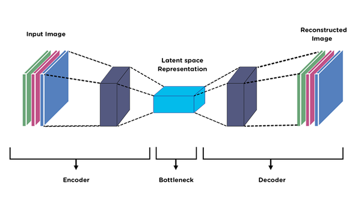

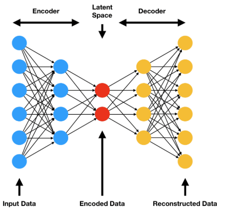

### 3.2. Sparse Autoencoder (SAE)
Sparse Autoencoder là một biến thể của AE không yêu cầu giảm số lượng nút ở lớp ẩn để tạo nút thắt cổ chai. Thay vào đó, nó sử dụng một hàm tổn thất có hình phạt (penalise) đối với các kích hoạt (activations) trong lớp ẩn [19]. Ý tưởng là mạng học cách mã hóa và giải mã dựa trên một tập hợp nhỏ các neuron hoạt động, hạn chế khả năng ghi nhớ máy móc.

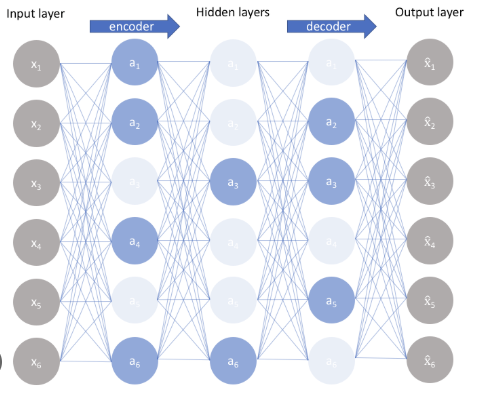

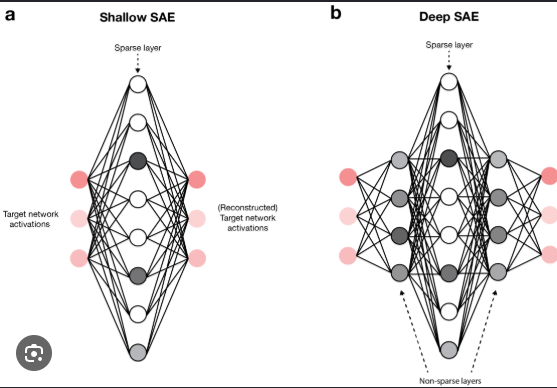

### 3.3. Variational Autoencoder (VAE)
Bản chất của VAE là bộ mã hóa đưa ra một phân phối xác suất cho mỗi đặc trưng trích xuất của dữ liệu đầu vào, thay vì gán một giá trị cố định [19]. Phân phối được giả định là phân phối chuẩn (Gaussian), nghĩa là chỉ cần đại diện bởi trung bình (mean) và độ lệch chuẩn (standard deviation). Một mẫu ngẫu nhiên từ phân phối này được chuyển tới bộ giải mã để tái tạo đầu vào ban đầu.
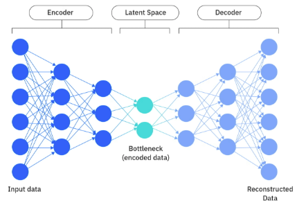

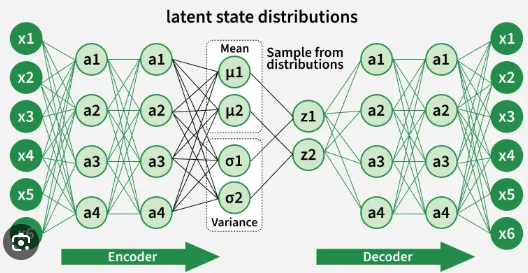

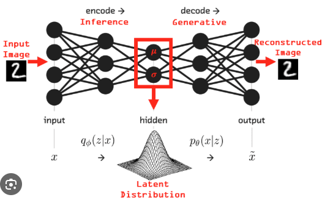

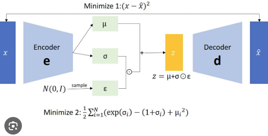

### 3.4. Long Short-Term Memory (LSTM)
LSTM là một biến thể của Mạng thần kinh hồi quy (Recurrent Neural Network - RNN) được thiết kế để học các phụ thuộc dài hạn [20]. Nó giới thiệu khái niệm ô bộ nhớ (memory cell) chứa các cổng (gates) giúp điều tiết thông tin đi qua ô. Kết quả là mạng thu được các trọng số ngữ cảnh xử lý linh hoạt chuỗi thời gian. Nguyên lý của AE được kết hợp vào kiến trúc LSTM để tạo thành **ED-LSTM** (Encoder-Decoder LSTM), vừa nén chiều dữ liệu vừa xét đến yếu tố thời gian.
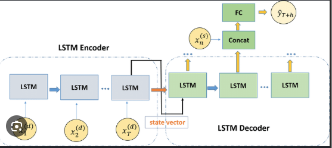
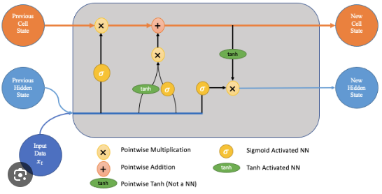
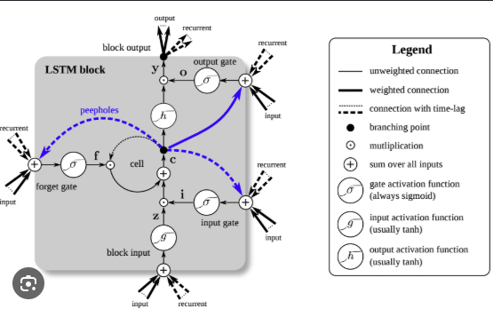
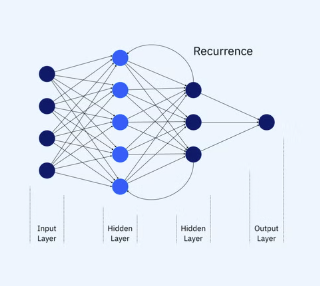

### 3.5. Convolutional Neural Network (CNN)
CNN là kỹ thuật học sâu nổi tiếng với hiệu suất cao trên dữ liệu ảnh, nhưng cũng có thể áp dụng cho dữ liệu 1D (chuỗi thời gian). CNN có khả năng tự động trích xuất đặc trưng và giảm chi phí tính toán nhờ chia sẻ trọng số (weight sharing) [25]. Bằng cách ghép nối các tín hiệu từ một cửa sổ thời gian trượt (sliding window), dữ liệu cảm biến chuỗi thời gian có thể chuyển thành định dạng tensor 2D giống như hình ảnh [26, 27]. Trong dự án này, CNN được sử dụng với kiến trúc Encoder-Decoder (**ED-CNN**).
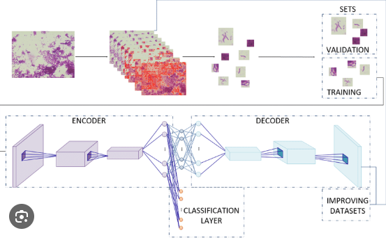
### 3.6. Deep Belief Network (DBN)
DBN là mô hình học sâu không giám sát do Hinton và cộng sự [28] đề xuất. DBN gồm nhiều lớp Restricted Boltzmann Machine (RBM) xếp chồng lên nhau. DBN có thể được huấn luyện để tái tạo đầu vào theo cơ chế xác suất.
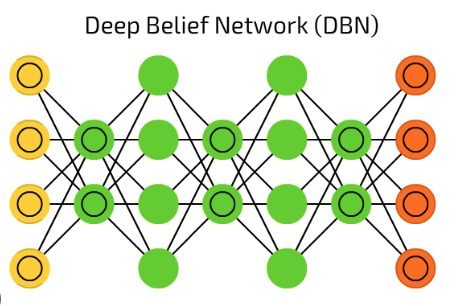

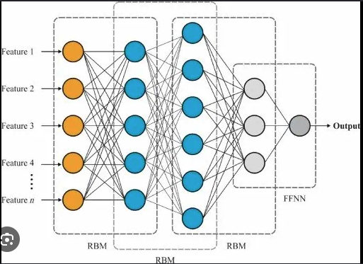

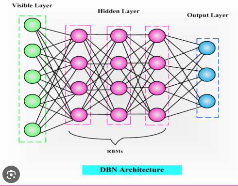
---

## 4. Dữ liệu (Data)

Dự án này là sự hợp tác với một công ty cung cấp thiết bị hàng hải. Một số thông tin như mốc thời gian, loại cảm biến và loại lỗi được ẩn danh do thỏa thuận bảo mật (NDA).

Trong dự án, có **25 bộ dữ liệu** bao gồm các dữ liệu cảm biến khác nhau từ máy nén khí. Năm loại chuỗi dữ liệu được ghi lại:
- **Lỗi A, Lỗi B, Lỗi C, Lỗi D**
- **Chuỗi vận hành bình thường (Normal)**

Các bộ dữ liệu với Lỗi A, B, C bắt đầu ở các tải vận hành khác nhau trong điều kiện bình thường. Tại một thời điểm ngẫu nhiên, hệ thống bắt đầu thoái hóa (degrade) cho đến khi ngưng hoạt động. Chuyên gia chuyên ngành đã đánh dấu các mốc mức độ nghiêm trọng **33%, 67% và 100%**.

- **Lỗi D:** Liên quan đến sự cố giao tiếp hệ thống điều khiển nội bộ, không làm hỏng máy nén khí.
- **Bình thường (Normal):** Các chuỗi máy nén hoạt động trong điều kiện tiêu chuẩn.

Mỗi bộ dữ liệu bao gồm các đo đạc từ **14 cảm biến** (áp suất, nhiệt độ, dòng điện, dầu).

**Bảng 1: Mô tả dữ liệu có sẵn và mục đích sử dụng**

| Loại chuỗi | Số bộ dữ liệu (# Datasets) | Độ dài chuỗi (Số mẫu) |
| :--- | :--- | :--- |
| Normal | 8 | 77 – 1250 |
| Lỗi A (Fault A) | 7 | 909 – 3643 |
| Lỗi B (Fault B) | 7 | 666 – 2554 |
| Lỗi C (Fault C) | 1 | 1064 – 1064 |
| Lỗi D (Fault D) | 2 | 1228 – 1660 |

### Dữ liệu đánh giá (Evaluation Data)
Một tập dữ liệu kiểm tra ngẫu nhiên gồm **350 mẫu** (150 mẫu bình thường và 200 mẫu bất thường từ các chuỗi chưa từng thấy) được sử dụng để đánh giá độ chính xác phân loại của các mô hình.

---

## 5. Phương pháp luận (Methodology)

Các mô hình sử dụng kiến trúc Encoder-Decoder (ED) được huấn luyện **chỉ trên dữ liệu bình thường**. Khi đó:
- Với dữ liệu bình thường: Mô hình tái tạo tốt $
ightarrow$ Sai số tái tạo (Reconstruction Error) thấp.
- Với dữ liệu bất thường/suy hao: Mô hình tái tạo kém $
ightarrow$ Sai số tái tạo cao.

Sai số tái tạo được tính bằng giá trị tuyệt đối trung bình giữa đầu vào $x$ và đầu ra tái tạo $\hat{x}$ (Công thức 1):

$$	ext{Reconstruction Error} = rac{1}{N} \sum_{i=1}^N |x_i - \hat{x}_i| 	ag{1}$$

### Biến đổi sang Thang điểm Bất thường (Anomaly Score) 0 - 100
Do sai số tái tạo thô không có thang đo mô tả rõ ràng, bài báo đề xuất phương pháp 3 bước chuyển đổi sai số này sang **Điểm bất thường (Anomaly Score)** từ 0 đến 100:

1. **Chuẩn hóa tuyến tính (Min-Max Scaling):** Đưa sai số tái tạo về dải thích hợp cho hàm Sigmoid (ví dụ từ $[-8, 8]$).
2. **Biến đổi Sigmoid (Sigmoid Transformation):**
   $$\sigma(z) = rac{1}{1 + e^{-z}} 	ag{2}$$
3. **Thang đo 0 - 100:** Nhân kết quả với 100.

Dải điểm được chia thành 3 vùng phân loại:
- **Vùng Bình thường (Normal zone):** 0 – 40 (Màu xanh)
- **Vùng Cảnh báo (Warning zone):** 40 – 60 (Màu vàng)
- **Vùng Nguy hiểm (Danger zone):** 60 – 100 (Màu đỏ)

---

## 6. Cấu hình mô hình (Model Configuration)

Các dữ liệu đầu vào được chuẩn hóa Min-Max về khoảng $[-1, 1]$ tương ứng với hàm kích hoạt `tanh` ở lớp đầu ra.

### 6.1. Kiến trúc và Tham số (Architecture and Parameters)

- **6.1.1. Autoencoder (AE):** Bộ tối ưu RMSProp, learning rate 0.0001, Xavier initialization. Kiến trúc lớp: 14 $
ightarrow$ 17-8-4-8-17 $
ightarrow$ 14.
- **6.1.2. Sparse Autoencoder (SAE):** RMSProp, learning rate 0.0001. Kiến trúc: 14 $
ightarrow$ 14-14-14-14-14 $
ightarrow$ 14 (sử dụng ràng buộc độ thưa - sparsity regularization).
- **6.1.3. Variational Autoencoder (VAE):** Mini-batch SGD, learning rate 0.001. Kiến trúc: 14 $
ightarrow$ 16-8-6-8-16 $
ightarrow$ 14. Không gian ẩn (latent space) có 6 chiều.
- **6.1.4. Deep Belief Network (DBN):** 3 lớp RBM xếp chồng (14 $
ightarrow$ 16-13-11), $k=10$, learning rate 0.003, bộ lọc trung bình trượt cửa sổ 50.
- **6.1.5. ED-LSTM:** SGD, learning rate 0.001, batch size 100, cửa sổ thời gian (time window) = 20. Các lớp ẩn: 10, 7, 10.
- **6.1.6. ED-CNN:** Cửa sổ thời gian = 20 (dữ liệu nén thành dạng ảnh 2D). Bộ tối ưu Adam (0.001). Sử dụng Conv2D, Max-pooling, Upsampling và kích hoạt ReLU/tanh.

---

## 7. Kết quả (Results)

### Đánh giá độ chính xác phân loại trên tập kiểm tra

**Bảng 9: Độ chính xác tổng thể và theo từng loại lỗi của 6 mô hình**

| Mô hình | Tổng thể (Total) | Lỗi A (Fault A) | Lỗi B (Fault B) | Lỗi C (Fault C) | Lỗi D (Fault D) |
| :--- | :---: | :---: | :---: | :---: | :---: |
| **AE** | 0.797 | 0.80 | 0.99 | 0.50 | 1.00 |
| **SAE** | 0.783 | 0.81 | 0.93 | 0.50 | 1.00 |
| **VAE** | **1.000** | **1.00** | **1.00** | **1.00** | **1.00** |
| **DBN** | 0.794 | 0.83 | 0.65 | 0.80 | 1.00 |
| **LSTM** | **1.000** | **1.00** | **1.00** | **1.00** | **1.00** |
| **CNN** | **0.963** | **1.00** | 0.87 | **1.00** | **1.00** |

**Bảng 10: Phân tích các trường hợp phân loại sai**

| Mô hình | Số mẫu sai (# Misses) | Số mẫu nằm trong vùng cảnh báo | Tỷ lệ nằm trong vùng cảnh báo |
| :--- | :---: | :---: | :---: |
| **AE** | 71 | 60 | 85% |
| **SAE** | 76 | 58 | 76% |
| **DBN** | 72 | 2 | 3% |
| **CNN** | 13 | 11 | 85% |

### Nhận xét kết quả:
1. **VAE và LSTM** đạt kết quả hoàn hảo **100% độ chính xác** trên tất cả các loại lỗi và dữ liệu bình thường.
2. **CNN** đạt độ chính xác cao **96.3%**.
3. Cả 3 mô hình tốt nhất (VAE, LSTM, CNN) đều phát hiện chính xác các dạng lỗi mới chưa từng xuất hiện trong quá trình huấn luyện (Lỗi C và D).
4. AE, SAE và DBN có độ chính xác thấp hơn (~78% - 80%).

---

## 8. Tính minh bạch của mô hình (Model Transparency & Explainability)

Để giải quyết nhược điểm "hộp đen" của các mô hình phát hiện bất thường, bài báo đề xuất phương pháp tính toán **Mức độ đóng góp của từng cảm biến (Sensor Contribution)** vào tổng sai số tái tạo.

Đóng góp của cảm biến $j$ tại mẫu $i$ được tính theo Công thức (3):

$$	ext{Contribution}_{	ext{Input}_{i,j}} = rac{|	ext{Input}_{i,j} - \hat{	ext{Input}}_{i,j}|}{	ext{Reconstruction Error}_i} 	imes 100\% 	ag{3}$$

### Kết quả phân tích tính đóng góp của cảm biến:
- **Đối với Lỗi A:** Cảm biến **S6** có mức độ đóng góp tăng dần liên tục khi thiết bị suy hao (từ ~16% lên >32%), cho thấy lỗi A có liên quan trực tiếp đến đại lượng mà cảm biến S6 đo đạc.
- **Đối với Lỗi B:** Cảm biến **S3** (chiếm ~28-30%) và **S5** (chiếm ~15-17%) là hai nhân tố chính đóng góp vào điểm bất thường.

Điều này giúp nhân viên kỹ thuật và vận hành không chỉ biết *hệ thống có bị lỗi hay không*, mà còn biết *bộ phận/cảm biến nào đang gặp sự cố*.

---

## 9. Thảo luận (Discussion)

1. **Hiệu năng mô hình:** Các mô hình xem xét đến yếu tố thời gian (LSTM, CNN) và mô hình xác suất (VAE) hoạt động vượt trội so với các mạng AE truyền thống và DBN.
2. **Thử nghiệm không giám sát:** Phương pháp không đòi hỏi dữ liệu sự cố lịch sử gán nhãn, cực kỳ thích hợp cho các thiết bị quan trọng trong công nghiệp hàng hải nơi sự cố hiếm khi xảy ra.
3. **Tính mở rộng:** Phương pháp đóng góp cảm biến có thể mở rộng cho các hệ thống lớn bằng cách xây dựng cấu trúc cây (tree-structure) đại diện cho các hệ thống phụ (sub-systems).

---

## 10. Kết luận (Conclusions)

Nghiên cứu đã chứng minh tính hiệu quả của việc kết hợp học sâu dựa trên tái tạo (đặc biệt là **VAE và ED-LSTM**) để phát hiện bất thường ở máy nén khí hàng hải. Việc chuyển đổi sai số tái tạo thành **Điểm bất thường (0-100)** cùng với **phương pháp đóng góp cảm biến** đã làm tăng đáng kể tính minh bạch và khả năng ứng dụng thực tế cho các hệ thống PHM.

### Hướng phát triển trong tương lai (Future Work)
- Thử nghiệm trên các hệ thống thiết bị phức tạp hơn.
- Tự động hóa quá trình tinh chỉnh tham số và chọn kiến trúc mạng.
- Xây dựng hệ thống tự động đánh giá chỉ số sức khỏe liên tục (Continuous Health Monitoring Pipeline).

---

## Tài liệu tham khảo (References)

1. Goebel, K. *Prognostics and Health Management*. IEEE Instrum. Meas. Mag. 2017, 11, 33–40.
2. Chalapathy, R.; Chawla, S. *Deep Learning for Anomaly Detection: A Survey*. arXiv 2019, arXiv:1901.03407.
3. Ellefsen, A.L. et al. *An Unsupervised Reconstruction-Based Fault Detection Algorithm for Maritime Components*. IEEE Access 2019, 7, 16101–16109.
4. Park, D. et al. *A Multimodal Anomaly Detector for Robot-Assisted Feeding Using an LSTM-Based Variational Autoencoder*. IEEE Robot. Autom. Lett. 2019, 3, 1544–1551.
5. Malhotra, P. et al. *Long Short Term Memory Networks for Anomaly Detection in Time Series*. ESANN 2015.
6. Malhotra, P. et al. *LSTM-based Encoder-Decoder for Multi-sensor Anomaly Detection*. arXiv 2016, arXiv:1607.00148.
7. Yan, W.; Yu, L. *On Accurate and Reliable Anomaly Detection for Gas Turbine Combustors: A Deep Learning Approach*. arXiv 2015.
8. An, J.; Cho, S. *Variational Autoencoder based Anomaly Detection using Reconstruction*. 2015.
9. Wulsin, D.F. et al. *Modeling electroencephalography waveforms with semi-supervised deep belief nets*. J. Neural Eng. 2011, 8, 036015.
10. Zenati, H. et al. *Efficient GAN-Based Anomaly Detection*. arXiv 2018.
